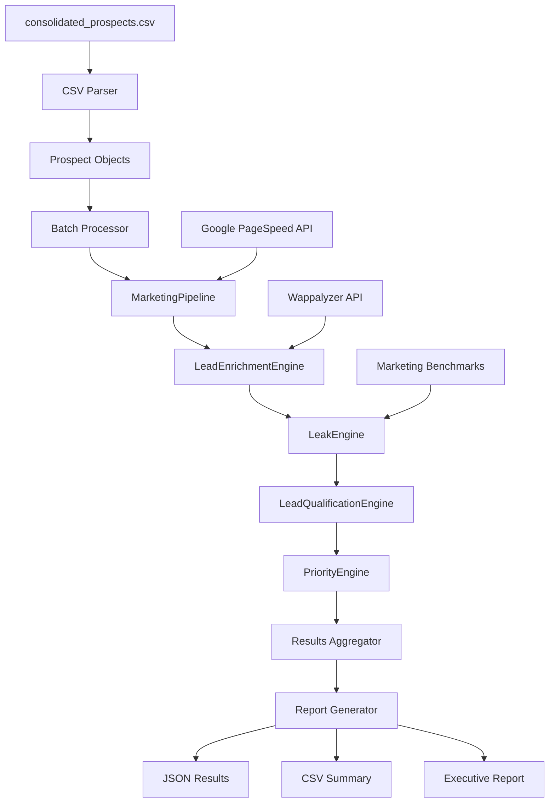

# Design Document

## Overview

Este design utiliza a infraestrutura existente e funcional em `/arco` para processar os 175 leads do arquivo `consolidated_prospects.csv` através de uma abordagem operacional estruturada. O sistema orquestra os engines existentes (MarketingPipeline, LeadEnrichmentEngine, LeakEngine, LeadQualificationEngine, PriorityEngine) em uma sequência otimizada para enriquecer dados reais, evitar retrabalho e amadurecer o projeto através de resultados concretos.

### Infraestrutura Existente Disponível

**Engines Funcionais em `/arco`:**

- **MarketingPipeline**: Coleta Web Vitals reais via Google PageSpeed Insights
- **LeadEnrichmentEngine**: Enriquece dados via Wappalyzer e inferência inteligente
- **LeakEngine**: Identifica vazamentos financeiros e calcula ROI real
- **LeadQualificationEngine**: Scoring avançado com tiers A/B/C/D
- **PriorityEngine**: Ranking final com critérios de priorização

**Vantagens da Abordagem Operacional:**

- Utiliza código já testado e funcional
- Dados reais de performance web (não estimativas)
- ROI calculado com base em vazamentos identificados
- Processamento em batches para eficiência
- Logging e monitoramento integrados

## Architecture

### Pipeline Orchestration Flow



### Data Flow Architecture

1. **Input Layer**: Carrega consolidated_prospects.csv (175 leads)
2. **Processing Layer**: Orquestra engines existentes em sequência
3. **Enrichment Layer**: Coleta dados reais via APIs externas
4. **Analysis Layer**: Aplica algoritmos de scoring e qualificação
5. **Output Layer**: Gera relatórios em múltiplos formatos

## Components and Interfaces

### 1. Lead Processing Orchestrator

```python
class LeadProcessingOrchestrator:
    """
    Orquestrador principal que utiliza os engines existentes em sequência.
    """

    def __init__(self):
        self.marketing_pipeline = MarketingPipeline()
        self.enrichment_engine = LeadEnrichmentEngine()
        self.leak_engine = LeakEngine()
        self.qualification_engine = LeadQualificationEngine()
        self.priority_engine = PriorityEngine()

    async def process_leads_from_csv(self, csv_path: str) -> ProcessingResults:
        """Processa todos os leads do CSV através dos engines existentes."""
        pass

    async def process_single_lead(self, prospect: Prospect) -> EnrichedQualifiedProspect:
        """Processa um lead através de toda a pipeline."""
        pass
```

### 2. CSV Data Adapter

```python
class CSVProspectAdapter:
    """
    Adaptador para converter dados do CSV em objetos Prospect compatíveis
    com os engines existentes.
    """

    def load_prospects_from_csv(self, csv_path: str) -> List[Prospect]:
        """Carrega e converte dados do CSV em objetos Prospect."""
        pass

    def map_csv_fields_to_prospect(self, csv_row: Dict) -> Prospect:
        """Mapeia campos do CSV para propriedades do Prospect."""
        pass

    def validate_prospect_data(self, prospect: Prospect) -> ValidationResult:
        """Valida se o Prospect tem dados mínimos necessários."""
        pass
```

### 3. Batch Processing Manager

```python
class BatchProcessingManager:
    """
    Gerenciador de processamento em lotes para otimizar performance
    e evitar rate limiting das APIs.
    """

    def __init__(self, batch_size: int = 10, delay_between_batches: float = 2.0):
        self.batch_size = batch_size
        self.delay_between_batches = delay_between_batches

    async def process_prospects_in_batches(self, prospects: List[Prospect]) -> List[ProcessingResult]:
        """Processa prospects em lotes com controle de rate limiting."""
        pass

    def calculate_optimal_batch_size(self, total_prospects: int, api_limits: Dict) -> int:
        """Calcula tamanho ótimo do lote baseado em limites de API."""
        pass
```

### 4. Results Aggregator

```python
class ResultsAggregator:
    """
    Agregador de resultados que consolida dados de todos os engines
    e gera insights consolidados.
    """

    def aggregate_processing_results(self, results: List[ProcessingResult]) -> AggregatedResults:
        """Agrega resultados de todos os leads processados."""
        pass

    def calculate_pipeline_statistics(self, results: List[ProcessingResult]) -> PipelineStats:
        """Calcula estatísticas de performance da pipeline."""
        pass

    def identify_top_prospects(self, results: List[ProcessingResult], count: int = 10) -> List[TopProspect]:
        """Identifica os top prospects baseado em scoring consolidado."""
        pass
```

## Data Models

### Enhanced Prospect Model

```python
@dataclass
class EnrichedQualifiedProspect:
    """Prospect enriquecido com dados de todos os engines."""

    # Dados originais do CSV
    original_data: Dict[str, Any]

    # Dados básicos do Prospect
    prospect: Prospect

    # Resultados do MarketingPipeline
    marketing_data: MarketingData
    web_vitals: WebVitals

    # Resultados do LeadEnrichmentEngine
    enrichment_result: EnrichmentResult

    # Resultados do LeakEngine
    leak_analysis: FinancialLeakResult

    # Resultados do LeadQualificationEngine
    qualification_score: LeadScore

    # Resultados do PriorityEngine
    priority_score: PriorityScore

    # Metadados de processamento
    processing_metadata: ProcessingMetadata
```

### Processing Results Model

```python
@dataclass
class ProcessingResults:
    """Resultados consolidados do processamento de todos os leads."""

    total_leads_processed: int
    successful_processing: int
    failed_processing: int

    # Estatísticas por engine
    marketing_pipeline_stats: Dict[str, Any]
    enrichment_engine_stats: Dict[str, Any]
    leak_engine_stats: Dict[str, Any]
    qualification_engine_stats: Dict[str, Any]
    priority_engine_stats: Dict[str, Any]

    # Top prospects identificados
    top_prospects: List[EnrichedQualifiedProspect]

    # Insights consolidados
    market_insights: MarketInsights
    geographic_distribution: Dict[str, int]
    technology_trends: Dict[str, int]

    # Recomendações de ação
    action_recommendations: List[ActionRecommendation]
```

## Implementation Strategy

### Phase 1: Infrastructure Setup (1 day)

1. **Verificar engines existentes**: Confirmar que todos os engines estão funcionais
2. **Configurar ambiente**: Validar APIs (Google PageSpeed, Wappalyzer)
3. **Testar com amostra**: Processar 5-10 leads para validar pipeline

### Phase 2: CSV Integration (1 day)

1. **Implementar CSVProspectAdapter**: Converter dados do CSV para objetos Prospect
2. **Validar mapeamento**: Garantir que todos os campos necessários estão mapeados
3. **Testar conversão**: Validar com subset dos 175 leads

### Phase 3: Orchestration Implementation (2 days)

1. **Implementar LeadProcessingOrchestrator**: Orquestrar engines em sequência
2. **Implementar BatchProcessingManager**: Controle de rate limiting
3. **Implementar error handling**: Tratamento robusto de erros

### Phase 4: Results Processing (1 day)

1. **Implementar ResultsAggregator**: Consolidar resultados
2. **Implementar report generation**: Gerar relatórios em JSON/CSV/MD
3. **Implementar insights generation**: Gerar insights acionáveis

### Phase 5: Full Processing (1 day)

1. **Processar todos os 175 leads**: Execução completa da pipeline
2. **Gerar relatórios finais**: Relatórios executivos e técnicos
3. **Validar resultados**: Verificar qualidade dos dados coletados

## Error Handling and Resilience

### Robust Error Handling

```python
class ProcessingErrorHandler:
    """
    Tratamento robusto de erros com retry e fallback.
    """

    async def process_with_retry(self, prospect: Prospect, max_retries: int = 3) -> ProcessingResult:
        """Processa prospect com retry automático em caso de falha."""
        pass

    def handle_api_rate_limiting(self, error: Exception) -> RetryStrategy:
        """Implementa backoff exponencial para rate limiting."""
        pass

    def log_processing_failure(self, prospect: Prospect, error: Exception) -> None:
        """Registra falhas para análise posterior."""
        pass
```

### Data Quality Validation

```python
class DataQualityValidator:
    """
    Validação de qualidade dos dados coletados.
    """

    def validate_marketing_data(self, marketing_data: MarketingData) -> ValidationResult:
        """Valida qualidade dos dados de marketing coletados."""
        pass

    def validate_enrichment_data(self, enrichment_result: EnrichmentResult) -> ValidationResult:
        """Valida qualidade dos dados de enriquecimento."""
        pass

    def calculate_data_completeness_score(self, prospect: EnrichedQualifiedProspect) -> float:
        """Calcula score de completude dos dados."""
        pass
```

## Performance Considerations

### API Rate Limiting Management

```python
class APIRateLimitManager:
    """
    Gerenciamento inteligente de rate limiting para APIs externas.
    """

    def __init__(self):
        self.google_pagespeed_limiter = RateLimiter(requests_per_minute=60)
        self.wappalyzer_limiter = RateLimiter(requests_per_minute=100)

    async def execute_with_rate_limit(self, api_call: Callable, limiter: RateLimiter) -> Any:
        """Executa chamada de API respeitando rate limits."""
        pass
```

### Caching Strategy

```python
class ProcessingCache:
    """
    Cache inteligente para evitar reprocessamento desnecessário.
    """

    def cache_web_vitals(self, domain: str, web_vitals: WebVitals) -> None:
        """Cache Web Vitals por 24 horas."""
        pass

    def cache_technology_stack(self, domain: str, technologies: List[Technology]) -> None:
        """Cache stack tecnológico por 7 dias."""
        pass

    def get_cached_data(self, domain: str, data_type: str) -> Optional[Any]:
        """Recupera dados do cache se disponíveis e válidos."""
        pass
```

## Output Formats

### Executive Report Format

```markdown
# Lead Analysis Executive Report

## Summary

- Total Leads Processed: 175
- Qualified Leads: 45 (25.7%)
- High Priority (Tier A): 12 leads
- Brazilian Market Focus: 89% of top prospects

## Top 10 Prospects

1. **Company Name** - Score: 95/100
   - Location: São Paulo, Brazil
   - Revenue Potential: $2.3M
   - Key Issues: Performance (LCP: 4.2s), Conversion (1.2%)
   - Recommended Action: Immediate outreach

## Market Insights

- E-commerce dominates (67% of qualified leads)
- Average LCP: 3.8s (industry benchmark: 2.5s)
- Conversion optimization opportunity: $12.4M total
```

### Technical Data Export

```json
{
  "processing_metadata": {
    "execution_date": "2025-07-18T20:00:00Z",
    "total_processing_time": "2h 15m",
    "engines_used": [
      "MarketingPipeline",
      "LeadEnrichmentEngine",
      "LeakEngine",
      "LeadQualificationEngine",
      "PriorityEngine"
    ]
  },
  "pipeline_statistics": {
    "marketing_data_success_rate": 0.87,
    "enrichment_success_rate": 0.94,
    "leak_detection_success_rate": 0.78,
    "qualification_success_rate": 1.0,
    "priority_scoring_success_rate": 1.0
  },
  "top_prospects": [
    {
      "domain": "example.com",
      "company_name": "Example Corp",
      "final_score": 95.2,
      "tier": "A",
      "priority_level": 1,
      "marketing_data": {
        "lcp": 4.2,
        "fid": 120,
        "cls": 0.15,
        "bounce_rate": 0.68,
        "conversion_rate": 0.012
      },
      "leak_analysis": {
        "monthly_waste": 8500,
        "annual_savings": 102000,
        "roi_percentage": 340
      }
    }
  ]
}
```

## Success Metrics

### Processing Metrics

- **Data Collection Success Rate**: >85% para Web Vitals, >90% para enrichment
- **Processing Speed**: <2 minutos por lead em média
- **Error Rate**: <5% de falhas não recuperáveis

### Business Metrics

- **Lead Quality**: >20% de leads qualificados (Tier A/B)
- **Brazilian Market Focus**: >80% dos top prospects brasileiros
- **ROI Identification**: >$50K em savings potenciais por lead qualificado

### Technical Metrics

- **API Efficiency**: Zero rate limiting violations
- **Data Completeness**: >80% de campos preenchidos nos top prospects
- **Cache Hit Rate**: >60% para dados reutilizáveis

## Risk Mitigation

### API Dependencies

- **Fallback Strategies**: Dados cached ou estimativas quando APIs falham
- **Rate Limiting**: Backoff exponencial e distribuição de carga
- **Timeout Handling**: Timeouts configuráveis com fallback

### Data Quality

- **Validation Layers**: Múltiplas validações em cada etapa
- **Confidence Scoring**: Score de confiança para cada dado coletado
- **Manual Review Flags**: Identificação de dados que precisam revisão manual

Esta abordagem operacional utiliza a infraestrutura existente e testada em `/arco`, evitando retrabalho e focando em resultados concretos através do processamento real dos 175 leads disponíveis.
