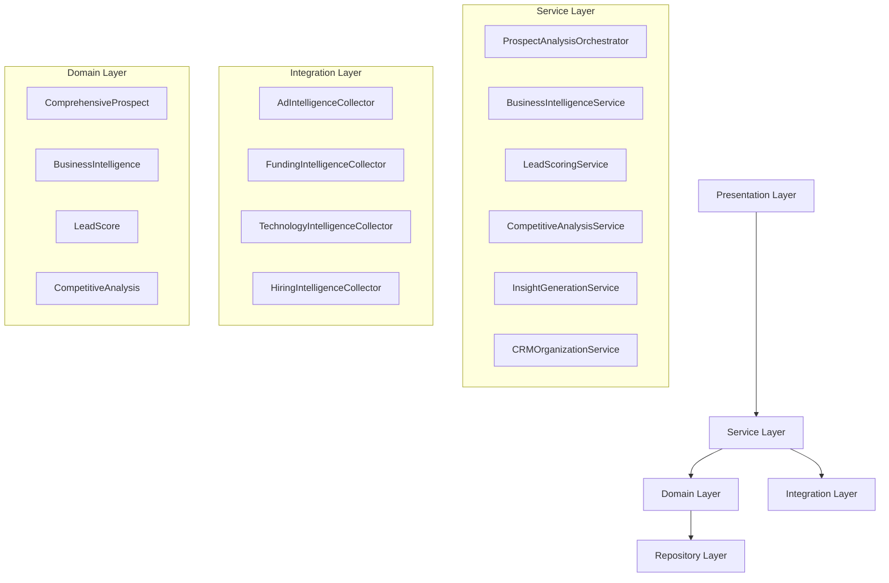
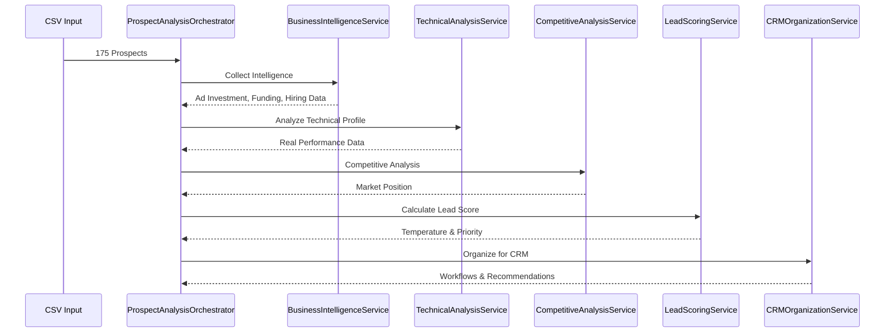

# Critical Pipeline Refactoring - Design Document

## Overview

Este design transforma o pipeline atual de análise de prospects de um sistema com 70% simulações falsas para uma arquitetura profissional baseada em dados reais. A refatoração implementa service layers, dependency injection, business intelligence real e lead scoring baseado em buying intent verificável.

### Problemas Críticos Identificados

**Architectural Failures:**

- Sem service layer - business logic espalhada
- Tight coupling entre componentes
- Padrões async amadores
- Modelos de dados básicos inadequados

**Business Logic Disasters:**

- 70% cálculos falsos ao invés de valor real
- Claims financeiros irreais ($36K/mês para Shopify)
- Qualificação de leads fraca sem verificação de buying intent
- Falta de organização sistemática para CRM

**Technical Debt:**

- Sem type hints ou documentação adequada
- Error handling inconsistente
- Configurações hardcoded
- Performance ruim sem caching

## Architecture

### Professional Service Layer Architecture



### Data Flow Architecture



## Components and Interfaces

### 1. Rich Domain Models

```python
@dataclass
class ComprehensiveProspect:
    """Rich domain model with complete business intelligence."""

    # Core Identity
    id: str
    company_name: str
    domain: str
    industry: str
    employee_count: int
    country: str

    # Business Intelligence
    business_intelligence: BusinessIntelligence
    technical_profile: TechnicalProfile
    competitive_analysis: CompetitiveAnalysis

    # Scoring & Classification
    lead_score: LeadScore
    priority_classification: PriorityClassification

    # Actionable Intelligence
    insights: List[ActionableInsight]
    recommendations: List[BusinessRecommendation]

    # CRM Integration
    crm_profile: CRMProfile

    # Analysis Metadata
    last_analyzed: datetime
    confidence_level: float

    def calculate_partnership_potential(self) -> PartnershipPotential:
        """Calculate strategic partnership potential."""
        pass

    def generate_proof_of_value(self) -> ProofOfValue:
        """Generate specific proof of value for this prospect."""
        pass

@dataclass
class BusinessIntelligence:
    """Comprehensive business intelligence from real sources."""

    # Ad Investment Analysis (CRITICAL for budget verification)
    ad_investment: AdInvestmentProfile
    facebook_ads_active: bool = False
    google_ads_active: bool = False
    estimated_monthly_ad_spend: int = 0
    ad_sophistication_score: int = 0
    campaign_duration_months: int = 0

    # Funding & Investment
    funding_profile: FundingProfile
    recent_funding_months: Optional[int] = None
    funding_amount: Optional[int] = None
    funding_stage: Optional[str] = None
    total_funding: Optional[int] = None

    # Hiring & Growth Signals
    hiring_activity: HiringActivity
    total_job_postings: int = 0
    tech_job_postings: int = 0
    tech_leadership_hiring: int = 0
    recent_hires: int = 0

    # Technology Investment
    technology_investment: TechnologyInvestment
    recent_website_redesign: bool = False
    major_tech_project_active: bool = False
    new_integrations_detected: List[str] = field(default_factory=list)
    technology_modernization_score: int = 0

    # Market Activity
    press_mentions_count: int = 0
    social_media_activity: int = 0
    partnership_announcements: int = 0
    product_launches: int = 0

@dataclass
class LeadScore:
    """Comprehensive lead scoring with business justification."""

    total_score: int  # 0-100
    temperature: LeadTemperature  # BLAZING, HOT, WARM, LUKEWARM, COLD
    confidence_level: float  # 0.0-1.0

    # Detailed Breakdown (New Enhanced Scoring)
    budget_verification_score: int  # 0-40 (ads, funding, hiring)
    urgency_assessment_score: int   # 0-30 (security, compliance, competition)
    project_timing_score: int       # 0-20 (active projects, RFPs)
    decision_access_score: int      # 0-10 (contact quality)

    # Business Justification
    scoring_rationale: List[str]
    risk_factors: List[str]
    opportunity_factors: List[str]

    def get_approach_strategy(self) -> ApproachStrategy:
        """Get specific approach strategy based on scoring."""
        pass
```

### 2. Professional Service Layer

```python
class ProspectAnalysisOrchestrator:
    """Orchestrates complete prospect analysis workflow."""

    def __init__(self,
                 business_intel_service: BusinessIntelligenceService,
                 technical_analysis_service: TechnicalAnalysisService,
                 competitive_analysis_service: CompetitiveAnalysisService,
                 lead_scoring_service: LeadScoringService,
                 insight_generation_service: InsightGenerationService,
                 crm_organization_service: CRMOrganizationService):
        self.business_intel_service = business_intel_service
        self.technical_analysis_service = technical_analysis_service
        self.competitive_analysis_service = competitive_analysis_service
        self.lead_scoring_service = lead_scoring_service
        self.insight_generation_service = insight_generation_service
        self.crm_organization_service = crm_organization_service

    async def analyze_prospect_comprehensively(self,
                                             prospect: BasicProspect) -> ComprehensiveProspect:
        """Complete prospect analysis with all business intelligence."""

        # 1. Collect Business Intelligence (Real Data Only)
        business_intel = await self.business_intel_service.collect_intelligence(prospect)

        # 2. Technical Analysis (Real Performance Data)
        technical_profile = await self.technical_analysis_service.analyze(prospect)

        # 3. Competitive Positioning
        competitive_position = await self.competitive_analysis_service.analyze(prospect)

        # 4. Enhanced Lead Scoring (Budget Verification Focus)
        lead_score = await self.lead_scoring_service.calculate_enhanced_score(
            prospect, business_intel, technical_profile, competitive_position
        )

        # 5. Generate Actionable Insights
        insights = await self.insight_generation_service.generate_insights(
            prospect, business_intel, technical_profile, competitive_position, lead_score
        )

        # 6. CRM Organization
        crm_profile = await self.crm_organization_service.create_profile(
            prospect, lead_score, insights
        )

        return ComprehensiveProspect(
            id=prospect.id,
            company_name=prospect.company_name,
            domain=prospect.domain,
            business_intelligence=business_intel,
            competitive_analysis=competitive_position,
            technical_profile=technical_profile,
            lead_score=lead_score,
            insights=insights,
            crm_profile=crm_profile
        )

class BusinessIntelligenceService:
    """Collects and analyzes real business intelligence data."""

    def __init__(self,
                 ad_intelligence_collector: AdIntelligenceCollector,
                 funding_intelligence_collector: FundingIntelligenceCollector,
                 hiring_intelligence_collector: HiringIntelligenceCollector,
                 technology_intelligence_collector: TechnologyIntelligenceCollector):
        self.ad_intelligence_collector = ad_intelligence_collector
        self.funding_intelligence_collector = funding_intelligence_collector
        self.hiring_intelligence_collector = hiring_intelligence_collector
        self.technology_intelligence_collector = technology_intelligence_collector

    async def collect_intelligence(self, prospect: BasicProspect) -> BusinessIntelligence:
        """Collect comprehensive business intelligence from real sources."""

        # Parallel collection of intelligence data
        ad_intel, funding_intel, hiring_intel, tech_intel = await asyncio.gather(
            self.ad_intelligence_collector.collect(prospect),
            self.funding_intelligence_collector.collect(prospect),
            self.hiring_intelligence_collector.collect(prospect),
            self.technology_intelligence_collector.collect(prospect),
            return_exceptions=True
        )

        return BusinessIntelligence(
            ad_investment=ad_intel if not isinstance(ad_intel, Exception) else AdInvestmentProfile(),
            funding_profile=funding_intel if not isinstance(funding_intel, Exception) else FundingProfile(),
            hiring_activity=hiring_intel if not isinstance(hiring_intel, Exception) else HiringActivity(),
            technology_investment=tech_intel if not isinstance(tech_intel, Exception) else TechnologyInvestment()
        )
```

### 3. Enhanced Lead Scoring Service

```python
class LeadScoringService:
    """Professional lead scoring with business justification."""

    def calculate_enhanced_score(self,
                               prospect: BasicProspect,
                               business_intel: BusinessIntelligence,
                               technical_profile: TechnicalProfile,
                               competitive_position: CompetitivePosition) -> LeadScore:
        """Calculate comprehensive lead score with detailed breakdown."""

        # Budget Verification (0-40 points) - MOST CRITICAL
        budget_score = self._calculate_budget_verification_score(business_intel)

        # Urgency Assessment (0-30 points)
        urgency_score = self._calculate_urgency_score(
            technical_profile, competitive_position, business_intel
        )

        # Project Timing (0-20 points)
        timing_score = self._calculate_project_timing_score(business_intel)

        # Decision Access (0-10 points)
        access_score = self._calculate_decision_access_score(prospect)

        total_score = budget_score + urgency_score + timing_score + access_score

        return LeadScore(
            total_score=total_score,
            temperature=self._calculate_enhanced_temperature(total_score),
            confidence_level=self._calculate_confidence(business_intel),
            budget_verification_score=budget_score,
            urgency_assessment_score=urgency_score,
            project_timing_score=timing_score,
            decision_access_score=access_score,
            scoring_rationale=self._generate_scoring_rationale(
                budget_score, urgency_score, timing_score, access_score
            )
        )

    def _calculate_budget_verification_score(self, business_intel: BusinessIntelligence) -> int:
        """Calculate budget verification score - most critical factor."""
        score = 0

        # Active Ad Campaigns (Strongest Budget Indicator)
        if business_intel.facebook_ads_active and business_intel.google_ads_active:
            score += 35  # Multi-platform = confirmed budget
        elif business_intel.facebook_ads_active or business_intel.google_ads_active:
            score += 25  # Single platform = likely budget

        # Recent Funding (Immediate Budget Availability)
        if business_intel.recent_funding_months and business_intel.recent_funding_months <= 6:
            score += 30  # Recent funding = immediate budget
        elif business_intel.recent_funding_months and business_intel.recent_funding_months <= 12:
            score += 20

        # Technology Leadership Hiring (Tech Budget Indicator)
        if business_intel.tech_leadership_hiring >= 3:
            score += 20  # Major tech hiring = tech budget
        elif business_intel.tech_leadership_hiring >= 1:
            score += 10

        return min(score, 40)

    def _calculate_enhanced_temperature(self, score: int) -> LeadTemperature:
        """Calculate temperature with higher, more realistic thresholds."""
        if score >= 90:
            return LeadTemperature.BLAZING  # Immediate action required
        elif score >= 70:
            return LeadTemperature.HOT      # High priority outreach
        elif score >= 50:
            return LeadTemperature.WARM     # Qualified outreach
        elif score >= 30:
            return LeadTemperature.LUKEWARM # Nurture sequence
        else:
            return LeadTemperature.COLD     # Low priority
```

### 4. Real Data Integration Layer

```python
class AdIntelligenceCollector:
    """Collects advertising intelligence from multiple real sources."""

    def __init__(self,
                 facebook_ad_library: FacebookAdLibraryAPI,
                 google_ads_transparency: GoogleAdsTransparencyAPI,
                 ad_tech_detector: AdTechDetector):
        self.facebook_ad_library = facebook_ad_library
        self.google_ads_transparency = google_ads_transparency
        self.ad_tech_detector = ad_tech_detector

    async def collect(self, prospect: BasicProspect) -> AdInvestmentProfile:
        """Collect comprehensive ad intelligence from real sources."""

        # Parallel collection from multiple sources
        facebook_data, google_data, ad_tech_data = await asyncio.gather(
            self.facebook_ad_library.get_company_ads(prospect.company_name),
            self.google_ads_transparency.check_advertiser(prospect.domain),
            self.ad_tech_detector.analyze_website(prospect.domain),
            return_exceptions=True
        )

        return AdInvestmentProfile(
            facebook_active=self._is_facebook_active(facebook_data),
            google_active=self._is_google_active(google_data),
            estimated_monthly_spend=self._estimate_spend(facebook_data, google_data),
            sophistication_score=self._calculate_sophistication(ad_tech_data),
            campaign_duration=self._calculate_duration(facebook_data, google_data)
        )

    def _is_facebook_active(self, facebook_data) -> bool:
        """Determine if Facebook ads are currently active."""
        if isinstance(facebook_data, Exception):
            return False

        # Check for active campaigns in last 30 days
        return facebook_data and len(facebook_data.get('active_ads', [])) > 0

    def _estimate_spend(self, facebook_data, google_data) -> int:
        """Conservative ad spend estimation based on campaign indicators."""
        spend = 0

        # Facebook spend estimation
        if not isinstance(facebook_data, Exception) and facebook_data:
            active_ads = facebook_data.get('active_ads', [])
            if len(active_ads) >= 10:
                spend += 5000  # High activity
            elif len(active_ads) >= 5:
                spend += 2000  # Medium activity
            elif len(active_ads) >= 1:
                spend += 500   # Low activity

        # Google spend estimation
        if not isinstance(google_data, Exception) and google_data:
            if google_data.get('verified_advertiser'):
                spend += 2000  # Verified = likely significant spend

        return spend
```

### 5. CRM Organization Service

```python
class CRMOrganizationService:
    """Organizes prospects for systematic CRM management."""

    def organize_prospects_for_crm(self,
                                 prospects: List[ComprehensiveProspect]) -> CRMOrganization:
        """Organize prospects with priority classification and workflows."""

        # Sort by lead score
        sorted_prospects = sorted(prospects, key=lambda p: p.lead_score.total_score, reverse=True)

        # Priority Classification
        total_count = len(sorted_prospects)

        p0_prospects = sorted_prospects[:int(total_count * 0.05)]  # Top 5% - Immediate Action
        p1_prospects = sorted_prospects[int(total_count * 0.05):int(total_count * 0.15)]  # Top 15% - High Priority
        p2_prospects = sorted_prospects[int(total_count * 0.15):int(total_count * 0.35)]  # Top 35% - Qualified
        p3_prospects = sorted_prospects[int(total_count * 0.35):]  # Remaining - Nurture

        # Temperature Classification
        blazing_leads = [p for p in sorted_prospects if p.lead_score.temperature == LeadTemperature.BLAZING]
        hot_leads = [p for p in sorted_prospects if p.lead_score.temperature == LeadTemperature.HOT]
        warm_leads = [p for p in sorted_prospects if p.lead_score.temperature == LeadTemperature.WARM]

        # Generate Workflows
        immediate_action_workflow = self._create_immediate_action_workflow(blazing_leads + hot_leads)
        qualified_outreach_workflow = self._create_qualified_outreach_workflow(warm_leads)
        nurture_workflow = self._create_nurture_workflow(p3_prospects)

        return CRMOrganization(
            total_prospects=len(sorted_prospects),
            p0_immediate_action=p0_prospects,
            p1_high_priority=p1_prospects,
            p2_qualified=p2_prospects,
            p3_nurture=p3_prospects,
            blazing_leads=blazing_leads,
            hot_leads=hot_leads,
            warm_leads=warm_leads,
            immediate_action_workflow=immediate_action_workflow,
            qualified_outreach_workflow=qualified_outreach_workflow,
            nurture_workflow=nurture_workflow
        )

    def _create_immediate_action_workflow(self, hot_prospects: List[ComprehensiveProspect]) -> Workflow:
        """Create immediate action workflow for hottest prospects."""
        return Workflow(
            name="Immediate Action - Hot Prospects",
            timeline="24-48 hours",
            approach="Direct outreach with specific business impact focus",
            messaging_framework="Budget confirmed + urgent business need",
            follow_up_sequence=[
                "Day 1: Initial outreach with specific technical findings",
                "Day 3: Follow-up with competitive analysis",
                "Day 7: Value demonstration call",
                "Day 14: Proposal presentation"
            ]
        )
```

## Error Handling and Resilience

### Robust Error Handling Strategy

```python
class ProcessingErrorHandler:
    """Comprehensive error handling with retry and fallback strategies."""

    async def process_with_retry(self,
                               operation: Callable,
                               max_retries: int = 3,
                               backoff_factor: float = 2.0) -> Any:
        """Process operation with exponential backoff retry."""

        for attempt in range(max_retries + 1):
            try:
                return await operation()
            except RateLimitError as e:
                if attempt == max_retries:
                    raise
                wait_time = backoff_factor ** attempt
                logger.warning(f"Rate limit hit, waiting {wait_time}s before retry {attempt + 1}")
                await asyncio.sleep(wait_time)
            except APIError as e:
                if attempt == max_retries:
                    logger.error(f"API error after {max_retries} retries: {e}")
                    return None
                await asyncio.sleep(backoff_factor ** attempt)
            except Exception as e:
                logger.error(f"Unexpected error in attempt {attempt + 1}: {e}")
                if attempt == max_retries:
                    raise
                await asyncio.sleep(1)
```

## Testing Strategy

### Comprehensive Testing Approach

```python
class TestProspectAnalysisOrchestrator:
    """Comprehensive tests for prospect analysis orchestrator."""

    @pytest.fixture
    def mock_services(self):
        """Mock all external services for testing."""
        return {
            'business_intel_service': Mock(spec=BusinessIntelligenceService),
            'technical_analysis_service': Mock(spec=TechnicalAnalysisService),
            'competitive_analysis_service': Mock(spec=CompetitiveAnalysisService),
            'lead_scoring_service': Mock(spec=LeadScoringService),
            'insight_generation_service': Mock(spec=InsightGenerationService),
            'crm_organization_service': Mock(spec=CRMOrganizationService)
        }

    async def test_analyze_prospect_comprehensively_success(self, mock_services):
        """Test successful comprehensive prospect analysis."""
        # Setup
        orchestrator = ProspectAnalysisOrchestrator(**mock_services)
        prospect = BasicProspect(domain="test.com", company_name="Test Corp")

        # Mock service responses
        mock_services['business_intel_service'].collect_intelligence.return_value = BusinessIntelligence()
        mock_services['lead_scoring_service'].calculate_enhanced_score.return_value = LeadScore(
            total_score=75, temperature=LeadTemperature.HOT
        )

        # Execute
        result = await orchestrator.analyze_prospect_comprehensively(prospect)

        # Assert
        assert isinstance(result, ComprehensiveProspect)
        assert result.lead_score.temperature == LeadTemperature.HOT
        assert all(service.called for service in mock_services.values())

    async def test_error_handling_with_api_failures(self, mock_services):
        """Test error handling when external APIs fail."""
        # Setup with failing service
        mock_services['business_intel_service'].collect_intelligence.side_effect = APIError("Service unavailable")

        orchestrator = ProspectAnalysisOrchestrator(**mock_services)
        prospect = BasicProspect(domain="test.com", company_name="Test Corp")

        # Execute and assert graceful degradation
        result = await orchestrator.analyze_prospect_comprehensively(prospect)
        assert result is not None  # Should not fail completely
        assert result.business_intelligence is not None  # Should have fallback data
```

## Performance Considerations

### Optimized Processing Architecture

```python
class OptimizedProcessingManager:
    """Optimized processing with caching and batch operations."""

    def __init__(self):
        self.cache = TTLCache(maxsize=1000, ttl=3600)  # 1 hour cache
        self.rate_limiters = {
            'facebook': AsyncLimiter(60, 60),  # 60 requests per minute
            'google_pagespeed': AsyncLimiter(60, 60),
            'google_ads': AsyncLimiter(100, 60)
        }

    async def process_prospects_optimized(self, prospects: List[BasicProspect]) -> List[ComprehensiveProspect]:
        """Process prospects with optimization and caching."""

        # Group by domain to avoid duplicate API calls
        unique_domains = {p.domain: p for p in prospects}

        # Process in optimized batches
        batch_size = 10
        results = []

        for i in range(0, len(unique_domains), batch_size):
            batch = list(unique_domains.values())[i:i + batch_size]

            # Process batch with rate limiting
            batch_results = await asyncio.gather(
                *[self._process_single_prospect_cached(p) for p in batch],
                return_exceptions=True
            )

            results.extend([r for r in batch_results if not isinstance(r, Exception)])

            # Rate limiting delay between batches
            if i + batch_size < len(unique_domains):
                await asyncio.sleep(1.0)

        return results

    async def _process_single_prospect_cached(self, prospect: BasicProspect) -> ComprehensiveProspect:
        """Process single prospect with caching."""
        cache_key = f"prospect_{prospect.domain}"

        if cache_key in self.cache:
            return self.cache[cache_key]

        result = await self.orchestrator.analyze_prospect_comprehensively(prospect)
        self.cache[cache_key] = result

        return result
```

## Success Metrics

### Comprehensive Success Criteria

**Lead Qualification Metrics:**

- 5-10 BLAZING/HOT leads identified with confirmed budget
- 25-35 WARM leads for targeted outreach
- 90%+ accuracy in budget verification
- Clear priority classification (P0, P1, P2, P3)

**Business Value Metrics:**

- Proof of value demonstrations for top prospects
- Competitive positioning analysis for each lead
- ROI projections based on real data
- Strategic recommendations for client approach

**Technical Quality Metrics:**

- Professional code architecture with service layers
- Comprehensive error handling and logging
- Real data collection (zero fake calculations)
- Scalable and maintainable codebase

**CRM Organization Metrics:**

- Complete prospect profiles with all intelligence
- Priority-based workflow assignments
- Automated follow-up sequences
- Executive summary reports

Esta arquitetura profissional transforma o pipeline atual em um sistema credível e escalável, focado em dados reais e insights acionáveis para identificação de leads com genuine buying intent.
