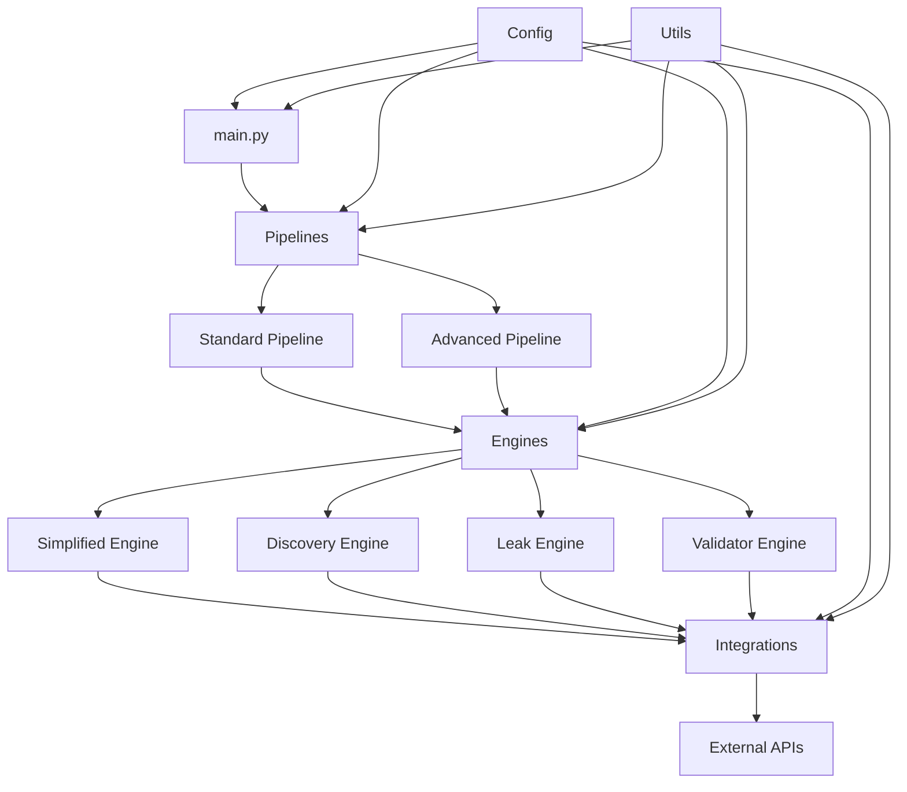

# Design Document - Refatoração do Projeto ARCO

## Overview

Este documento detalha o design técnico para a refatoração do projeto ARCO, com foco na reorganização da estrutura do projeto, eliminação de código duplicado, e estabelecimento de uma arquitetura modular e sustentável. O objetivo é transformar a base de código atual, que está desorganizada e com muita duplicação, em uma estrutura limpa e bem organizada que siga as melhores práticas de desenvolvimento Python.

## Arquitetura

A nova arquitetura do projeto ARCO seguirá um design modular com separação clara de responsabilidades. A estrutura será organizada em camadas lógicas:

1. **Camada de Interface** (main.py): Ponto de entrada único que gerencia a CLI e orquestra os pipelines
2. **Camada de Pipeline**: Implementações dos fluxos de trabalho standard e advanced
3. **Camada de Engine**: Componentes core que implementam a lógica de negócios
4. **Camada de Integração**: Adaptadores para serviços e APIs externos
5. **Camada de Configuração**: Configurações centralizadas e gerenciamento de ambiente
6. **Camada de Utilidades**: Ferramentas e helpers compartilhados

### Diagrama de Arquitetura



## Nova Estrutura de Diretórios

A nova estrutura de diretórios será organizada da seguinte forma:

```
arco/
├── main.py                  # Ponto de entrada principal
├── README.md                # Documentação principal
├── requirements.txt         # Dependências do projeto
├── setup.py                 # Script de instalação
├── .env.template            # Template para variáveis de ambiente
├── arco/                    # Pacote principal
│   ├── __init__.py
│   ├── pipelines/           # Implementações de pipeline
│   │   ├── __init__.py
│   │   ├── standard.py      # Pipeline padrão
│   │   └── advanced.py      # Pipeline avançado
│   ├── engines/             # Motores de processamento
│   │   ├── __init__.py
│   │   ├── simplified.py    # Motor simplificado
│   │   ├── discovery.py     # Motor de descoberta
│   │   ├── leak.py          # Detector de vazamentos
│   │   └── validator.py     # Motor de validação
│   ├── models/              # Modelos de dados
│   │   ├── __init__.py
│   │   ├── prospect.py      # Modelo de prospect
│   │   └── leak.py          # Modelo de vazamento
│   ├── integrations/        # Integrações com APIs externas
│   │   ├── __init__.py
│   │   ├── wappalyzer.py    # Integração com Wappalyzer
│   │   └── google_api.py    # Integração com APIs Google
│   ├── config/              # Configurações
│   │   ├── __init__.py
│   │   ├── settings.py      # Gerenciador de configurações
│   │   └── defaults.py      # Valores padrão
│   └── utils/               # Utilitários
│       ├── __init__.py
│       ├── logger.py        # Configuração de logging
│       └── helpers.py       # Funções auxiliares
├── config/                  # Arquivos de configuração externos
│   ├── production.yml       # Configurações de produção
│   └── vendor_costs.yml     # Custos de fornecedores
├── tests/                   # Testes unificados
│   ├── __init__.py
│   ├── test_pipelines/      # Testes de pipelines
│   ├── test_engines/        # Testes de engines
│   └── test_integrations/   # Testes de integrações
├── docs/                    # Documentação
│   ├── architecture.md      # Documentação de arquitetura
│   ├── usage.md             # Guia de uso
│   └── development.md       # Guia de desenvolvimento
└── archive/                 # Código legado arquivado
    └── README.md            # Explicação do conteúdo arquivado
```

## Componentes e Interfaces

### Interfaces Principais

#### 1. Interface de Pipeline

```python
class Pipeline:
    """Interface base para todos os pipelines."""

    async def run(self, **kwargs):
        """Executa o pipeline com os parâmetros fornecidos."""
        raise NotImplementedError("Subclasses devem implementar este método")
```

#### 2. Interface de Engine

```python
class Engine:
    """Interface base para todos os motores de processamento."""

    async def process(self, input_data):
        """Processa os dados de entrada e retorna o resultado."""
        raise NotImplementedError("Subclasses devem implementar este método")
```

#### 3. Interface de Integração

```python
class Integration:
    """Interface base para integrações com serviços externos."""

    async def connect(self):
        """Estabelece conexão com o serviço externo."""
        raise NotImplementedError("Subclasses devem implementar este método")

    async def execute(self, request):
        """Executa uma requisição no serviço externo."""
        raise NotImplementedError("Subclasses devem implementar este método")
```

### Componentes Principais

#### 1. StandardPipeline

Responsável por executar o fluxo de trabalho padrão sem dependências externas.

```python
class StandardPipeline(Pipeline):
    """Pipeline padrão para análise simplificada."""

    def __init__(self):
        self.engine = SimplifiedEngine()

    async def run(self, domains: List[str]) -> List[Dict]:
        """Executa análise simplificada para os domínios fornecidos."""
        return await self.engine.process(domains)
```

#### 2. AdvancedPipeline

Responsável por executar o fluxo de trabalho avançado com integrações externas.

```python
class AdvancedPipeline(Pipeline):
    """Pipeline avançado para análise completa com APIs externas."""

    def __init__(self):
        self.discovery_engine = DiscoveryEngine()
        self.leak_engine = LeakEngine()
        self.validator_engine = ValidatorEngine()

    async def run(self, target_count: int = 40) -> List[QualifiedProspect]:
        """Executa o pipeline completo de qualificação."""
        # Implementação do fluxo de trabalho
```

## Modelos de Dados

### Prospect

```python
@dataclass
class Prospect:
    """Modelo base para um prospect."""
    domain: str
    company_name: str
```

### QualifiedProspect

```python
@dataclass
class QualifiedProspect:
    """Prospect totalmente qualificado."""
    # Discovery data
    domain: str
    company_name: str
    employee_count: int
    estimated_revenue: int

    # Leak detection data
    monthly_waste: float
    annual_savings: float
    leak_count: int
    top_leaks: List[Dict]

    # Qualification
    qualification_score: int  # 0-100
    priority_tier: str        # A, B, C
    outreach_ready: bool
```

### LeakResult

```python
@dataclass
class LeakResult:
    """Resultado da detecção de vazamentos."""
    domain: str
    total_monthly_waste: float
    leaks: List[Leak]
    authority_score: float
    has_ads: bool
    processing_time: float
```

## Estratégia de Tratamento de Erros

A estratégia de tratamento de erros será implementada em múltiplas camadas:

1. **Logging Centralizado**: Implementação de um sistema de logging centralizado que captura erros em todos os níveis da aplicação.

2. **Tratamento de Exceções Específicas**: Definição de exceções personalizadas para diferentes tipos de erros:

   - `ConfigurationError`: Erros relacionados à configuração
   - `IntegrationError`: Erros de integração com serviços externos
   - `ValidationError`: Erros de validação de dados

3. **Graceful Degradation**: Os pipelines serão projetados para continuar funcionando mesmo quando algumas integrações falham, com fallbacks apropriados.

4. **Retry Mechanism**: Implementação de mecanismos de retry para operações que podem falhar temporariamente, especialmente integrações com APIs externas.

## Estratégia de Testes

A estratégia de testes será abrangente e incluirá:

1. **Testes Unitários**: Para componentes individuais, com mocks para dependências externas.

2. **Testes de Integração**: Para verificar a interação entre componentes.

3. **Testes End-to-End**: Para validar os fluxos de trabalho completos dos pipelines.

4. **Fixtures de Teste**: Dados de teste padronizados para garantir consistência nos testes.

5. **CI/CD Integration**: Integração com sistemas de CI/CD para execução automática de testes.

## Estratégia de Migração

A migração do código existente para a nova estrutura seguirá estas etapas:

1. **Consolidação de Código Legado**: Mover todo o código legado para a pasta `archive/`.

2. **Criação da Nova Estrutura**: Estabelecer a nova estrutura de diretórios.

3. **Migração Incremental**: Migrar componentes um por um, começando pelos mais fundamentais.

4. **Testes Contínuos**: Garantir que a funcionalidade seja preservada através de testes contínuos.

5. **Atualização da Documentação**: Atualizar a documentação para refletir a nova estrutura.

6. **Validação Final**: Executar testes completos para garantir que tudo funcione como esperado.
