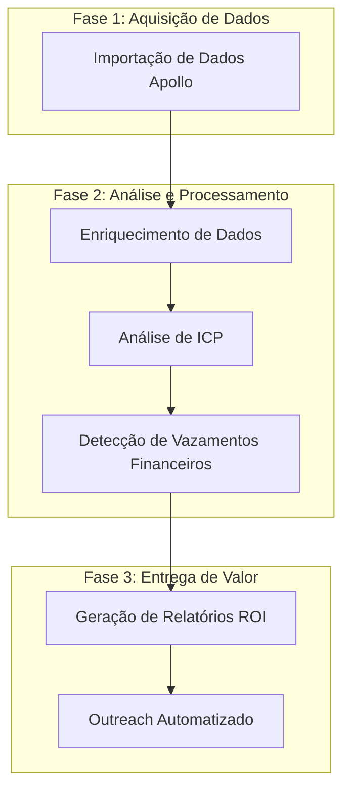

# Plano de Execução do Pipeline ARCO com Dados Apollo

## Visão Geral

Este documento apresenta o plano de execução consolidado para o pipeline ARCO, focando na utilização de dados reais de empresas obtidos através da integração com o Apollo CSV. O objetivo é gerar insights de valor real e acionáveis para empresas, identificando oportunidades de otimização de SaaS e vazamentos financeiros.

## Fluxo de Execução



## Fase 1: Aquisição de Dados

### 1.1 Importação de Dados Apollo

**Objetivo:** Importar dados reais de empresas dos arquivos CSV do Apollo.

**Ações:**

- Carregar todos os arquivos CSV do Apollo disponíveis
- Converter registros para o modelo de Prospect do ARCO
- Validar e limpar dados para garantir qualidade

**Métricas:**

- Número total de prospectos importados
- Taxa de dados completos (% de registros com todos os campos essenciais)
- Distribuição por indústria, tamanho e localização

**Código de Execução:**

```python
from arco.integrations.apollo_csv import ApolloCSVIntegration

# Inicializar a integração Apollo
apollo_integration = ApolloCSVIntegration()

# Importar todos os prospectos
prospects = apollo_integration.get_all_prospects()
print(f"Importados {len(prospects)} prospectos do Apollo")

# Análise básica de distribuição
industries = {}
sizes = {"1-10": 0, "11-50": 0, "51-200": 0, "201+": 0}
countries = {}

for prospect in prospects:
    # Contagem por indústria
    if prospect.industry:
        industries[prospect.industry] = industries.get(prospect.industry, 0) + 1

    # Contagem por tamanho
    if prospect.employee_count:
        if prospect.employee_count <= 10:
            sizes["1-10"] += 1
        elif prospect.employee_count <= 50:
            sizes["11-50"] += 1
        elif prospect.employee_count <= 200:
            sizes["51-200"] += 1
        else:
            sizes["201+"] += 1

    # Contagem por país
    if prospect.country:
        countries[prospect.country] = countries.get(prospect.country, 0) + 1

# Exibir resultados
print("\nDistribuição por indústria:")
for industry, count in sorted(industries.items(), key=lambda x: x[1], reverse=True)[:10]:
    print(f"- {industry}: {count}")

print("\nDistribuição por tamanho:")
for size, count in sizes.items():
    print(f"- {size}: {count}")

print("\nDistribuição por país:")
for country, count in sorted(countries.items(), key=lambda x: x[1], reverse=True)[:10]:
    print(f"- {country}: {count}")
```

## Fase 2: Análise e Processamento

### 2.1 Enriquecimento de Dados

**Objetivo:** Complementar os dados do Apollo com informações adicionais para análise mais precisa.

**Ações:**

- Enriquecer dados de tecnologia usando Wappalyzer
- Validar e normalizar dados de receita e número de funcionários
- Categorizar empresas por vertical de mercado

**Métricas:**

- Taxa de enriquecimento (% de prospectos com dados adicionados)
- Número médio de tecnologias identificadas por prospecto
- Precisão da categorização de mercado

**Código de Execução:**

```python
from arco.integrations.wappalyzer import WappalyzerIntegration
from arco.models.prospect import Technology
import asyncio

# Inicializar integração Wappalyzer
wappalyzer = WappalyzerIntegration()

# Função para enriquecer um prospecto
async def enrich_prospect(prospect):
    # Enriquecer com tecnologias do Wappalyzer
    if prospect.website:
        try:
            tech_data = await wappalyzer.analyze_url(prospect.website)

            # Adicionar tecnologias que ainda não existem no prospecto
            existing_tech_names = {tech.name.lower() for tech in prospect.technologies}

            for tech_name, tech_info in tech_data.items():
                if tech_name.lower() not in existing_tech_names:
                    category = tech_info.get('category', 'other')
                    version = tech_info.get('version')
                    prospect.technologies.append(Technology(name=tech_name, category=category, version=version))

            return True
        except Exception as e:
            print(f"Erro ao enriquecer {prospect.domain}: {e}")
            return False
    return False

# Enriquecer todos os prospectos
async def enrich_all_prospects(prospects, batch_size=10):
    enriched_count = 0
    total_techs_before = sum(len(p.technologies) for p in prospects)

    # Processar em lotes para evitar sobrecarga
    for i in range(0, len(prospects), batch_size):
        batch = prospects[i:i+batch_size]
        tasks = [enrich_prospect(p) for p in batch]
        results = await asyncio.gather(*tasks)
        enriched_count += sum(results)
        print(f"Processado lote {i//batch_size + 1}/{(len(prospects)-1)//batch_size + 1}")

    total_techs_after = sum(len(p.technologies) for p in prospects)

    print(f"\nEnriquecimento concluído:")
    print(f"- Prospectos enriquecidos: {enriched_count}/{len(prospects)} ({enriched_count/len(prospects):.1%})")
    print(f"- Tecnologias antes: {total_techs_before}")
    print(f"- Tecnologias depois: {total_techs_after}")
    print(f"- Tecnologias adicionadas: {total_techs_after - total_techs_before}")
    print(f"- Média de tecnologias por prospecto: {total_techs_after/len(prospects):.1f}")

    return prospects

# Executar enriquecimento
enriched_prospects = asyncio.run(enrich_all_prospects(prospects))
```

### 2.2 Análise de ICP (Ideal Customer Profile)

**Objetivo:** Identificar prospectos que melhor se alinham aos ICPs definidos.

**Ações:**

- Aplicar modelos de ICP aos prospectos enriquecidos
- Calcular scores de match para cada ICP
- Priorizar prospectos com maior potencial de conversão

**Métricas:**

- Distribuição de scores de match por ICP
- Número de prospectos qualificados por ICP
- Taxa de qualificação (% de prospectos que atingem o threshold)

**Código de Execução:**

```python
from arco.models.icp import ShopifyDTCPremiumICP, HealthSupplementsICP, FitnessEquipmentICP
from arco.engines.discovery_engine import DiscoveryEngine

# Criar ICPs
icps = {
    "shopify_dtc": ShopifyDTCPremiumICP(),
    "health_supplements": HealthSupplementsICP(),
    "fitness_equipment": FitnessEquipmentICP()
}

# Analisar prospectos para cada ICP
icp_results = {}

for icp_name, icp in icps.items():
    # Criar engine com o ICP
    engine = DiscoveryEngine(icp=icp)

    # Filtrar prospectos qualificados
    qualified_prospects = engine._filter_prospects_by_icp(enriched_prospects)

    # Calcular scores para todos os prospectos
    all_scores = []
    for prospect in enriched_prospects:
        score = icp.calculate_match_score(prospect)
        all_scores.append(score)

    # Calcular métricas
    icp_results[icp_name] = {
        "icp_name": icp.name,
        "total_prospects": len(enriched_prospects),
        "qualified_prospects": len(qualified_prospects),
        "qualification_rate": len(qualified_prospects) / len(enriched_prospects),
        "avg_match_score": sum(all_scores) / len(all_scores),
        "score_distribution": {
            "0-25": sum(1 for s in all_scores if s < 25),
            "25-50": sum(1 for s in all_scores if 25 <= s < 50),
            "50-75": sum(1 for s in all_scores if 50 <= s < 75),
            "75-100": sum(1 for s in all_scores if s >= 75)
        },
        "qualified_list": qualified_prospects
    }

# Exibir resultados
for icp_name, results in icp_results.items():
    print(f"\nResultados para ICP: {results['icp_name']}")
    print(f"- Total de prospectos: {results['total_prospects']}")
    print(f"- Prospectos qualificados: {results['qualified_prospects']} ({results['qualification_rate']:.1%})")
    print(f"- Score médio: {results['avg_match_score']:.1f}/100")
    print(f"- Distribuição de scores:")
    for range_name, count in results['score_distribution'].items():
        print(f"  * {range_name}: {count} ({count/results['total_prospects']:.1%})")
```

### 2.3 Detecção de Vazamentos Financeiros

**Objetivo:** Identificar oportunidades reais de economia e otimização para cada prospecto.

**Ações:**

- Analisar stack de tecnologia para identificar redundâncias
- Estimar desperdícios financeiros com base em dados reais
- Priorizar oportunidades de maior impacto

**Métricas:**

- Valor total de vazamentos financeiros identificados
- Média de economia mensal por prospecto
- Distribuição de tipos de vazamento

**Código de Execução:**

```python
from arco.models.financial_leak import FinancialLeakDetector

# Criar detector de vazamentos financeiros
leak_detector = FinancialLeakDetector()

# Analisar vazamentos para cada ICP
leak_results_by_icp = {}

for icp_name, results in icp_results.items():
    qualified_prospects = results["qualified_list"]

    # Inicializar resultados para este ICP
    leak_results_by_icp[icp_name] = {
        "icp_name": results["icp_name"],
        "total_prospects": len(qualified_prospects),
        "total_monthly_waste": 0.0,
        "total_annual_waste": 0.0,
        "total_monthly_savings": 0.0,
        "total_annual_savings": 0.0,
        "avg_roi_percentage": 0.0,
        "redundancy_types": {},
        "prospect_results": []
    }

    # Analisar cada prospecto
    roi_percentages = []

    for prospect in qualified_prospects:
        # Detectar vazamentos financeiros
        leak_result = leak_detector.detect_financial_leaks(prospect)
        summary = leak_result["summary"]

        # Adicionar ao total
        leak_results_by_icp[icp_name]["total_monthly_waste"] += summary["total_monthly_waste"]
        leak_results_by_icp[icp_name]["total_annual_waste"] += summary["total_annual_waste"]
        leak_results_by_icp[icp_name]["total_monthly_savings"] += summary["total_monthly_savings"]
        leak_results_by_icp[icp_name]["total_annual_savings"] += summary["total_annual_savings"]

        # Adicionar ROI percentage à lista para cálculo de média
        if summary["roi_percentage"] > 0:
            roi_percentages.append(summary["roi_percentage"])

        # Contar tipos de redundância
        if "redundant_apps" in leak_result and leak_result["redundant_apps"]["redundancies_detected"]:
            for pattern in leak_result["redundant_apps"]["patterns_matched"]:
                pattern_name = pattern["name"]
                leak_results_by_icp[icp_name]["redundancy_types"][pattern_name] = leak_results_by_icp[icp_name]["redundancy_types"].get(pattern_name, 0) + 1

        # Adicionar resultado individual
        leak_results_by_icp[icp_name]["prospect_results"].append({
            "domain": prospect.domain,
            "company_name": prospect.company_name,
            "monthly_waste": summary["total_monthly_waste"],
            "annual_waste": summary["total_annual_waste"],
            "monthly_savings": summary["total_monthly_savings"],
            "annual_savings": summary["total_annual_savings"],
            "roi_percentage": summary["roi_percentage"]
        })

    # Calcular média de ROI
    if roi_percentages:
        leak_results_by_icp[icp_name]["avg_roi_percentage"] = sum(roi_percentages) / len(roi_percentages)

    # Ordenar prospectos por economia anual
    leak_results_by_icp[icp_name]["prospect_results"].sort(key=lambda x: x["annual_savings"], reverse=True)

# Exibir resultados
for icp_name, results in leak_results_by_icp.items():
    print(f"\nResultados de vazamentos financeiros para ICP: {results['icp_name']}")
    print(f"- Total de prospectos analisados: {results['total_prospects']}")
    print(f"- Desperdício mensal total: ${results['total_monthly_waste']:,.2f}")
    print(f"- Desperdício anual total: ${results['total_annual_waste']:,.2f}")
    print(f"- Economia mensal total: ${results['total_monthly_savings']:,.2f}")
    print(f"- Economia anual total: ${results['total_annual_savings']:,.2f}")
    print(f"- ROI percentual médio: {results['avg_roi_percentage']:.1f}%")

    print("\nTipos de redundância mais comuns:")
    for redundancy_type, count in sorted(results["redundancy_types"].items(), key=lambda x: x[1], reverse=True):
        print(f"- {redundancy_type}: {count} ocorrências ({count/results['total_prospects']:.1%})")

    print("\nTop 5 prospectos com maior potencial de economia:")
    for i, prospect_result in enumerate(results["prospect_results"][:5]):
        print(f"{i+1}. {prospect_result['company_name']} ({prospect_result['domain']})")
        print(f"   - Economia anual: ${prospect_result['annual_savings']:,.2f}")
        print(f"   - ROI: {prospect_result['roi_percentage']:.1f}%")
```

## Fase 3: Entrega de Valor

### 3.1 Geração de Relatórios ROI

**Objetivo:** Criar relatórios personalizados de ROI para cada prospecto qualificado.

**Ações:**

- Gerar relatórios detalhados de ROI com base nos dados reais
- Personalizar recomendações para cada prospecto
- Preparar materiais para apresentação ao cliente

**Métricas:**

- Número de relatórios gerados
- Economia média projetada por relatório
- Distribuição de tipos de recomendação

**Código de Execução:**

```python
from arco.models.roi_report import ROIReportGenerator
import os

# Criar gerador de relatórios ROI
report_generator = ROIReportGenerator()

# Criar diretório para relatórios
reports_dir = "roi_reports"
os.makedirs(reports_dir, exist_ok=True)

# Gerar relatórios para cada ICP
report_stats = {}

for icp_name, results in leak_results_by_icp.items():
    # Criar subdiretório para este ICP
    icp_dir = os.path.join(reports_dir, icp_name)
    os.makedirs(icp_dir, exist_ok=True)

    # Inicializar estatísticas
    report_stats[icp_name] = {
        "icp_name": results["icp_name"],
        "reports_generated": 0,
        "total_annual_savings": 0.0,
        "avg_annual_savings": 0.0,
        "recommendation_types": {}
    }

    # Gerar relatórios para os top prospectos
    top_prospects = results["prospect_results"][:20]  # Limitar aos top 20

    for prospect_result in top_prospects:
        # Encontrar o objeto Prospect correspondente
        prospect = next((p for p in enriched_prospects if p.domain == prospect_result["domain"]), None)

        if prospect:
            # Gerar relatório
            report = report_generator.generate_roi_report(prospect)

            # Salvar relatório
            filepath = report_generator.save_report_to_file(report, icp_dir)

            # Gerar versão HTML
            html_content = report_generator.generate_html_report(report)
            html_filepath = filepath.replace(".md", ".html")
            with open(html_filepath, "w", encoding="utf-8") as f:
                f.write(html_content)

            # Atualizar estatísticas
            report_stats[icp_name]["reports_generated"] += 1
            report_stats[icp_name]["total_annual_savings"] += prospect_result["annual_savings"]

            # Contar tipos de recomendação
            for rec in report["financial_leaks"]["priority_recommendations"]:
                rec_type = rec.split(":")[0] if ":" in rec else rec
                report_stats[icp_name]["recommendation_types"][rec_type] = report_stats[icp_name]["recommendation_types"].get(rec_type, 0) + 1

    # Calcular média
    if report_stats[icp_name]["reports_generated"] > 0:
        report_stats[icp_name]["avg_annual_savings"] = report_stats[icp_name]["total_annual_savings"] / report_stats[icp_name]["reports_generated"]

# Exibir estatísticas
for icp_name, stats in report_stats.items():
    print(f"\nEstatísticas de relatórios para ICP: {stats['icp_name']}")
    print(f"- Relatórios gerados: {stats['reports_generated']}")
    print(f"- Economia anual total: ${stats['total_annual_savings']:,.2f}")
    print(f"- Economia anual média: ${stats['avg_annual_savings']:,.2f}")

    print("\nTipos de recomendação mais comuns:")
    for rec_type, count in sorted(stats["recommendation_types"].items(), key=lambda x: x[1], reverse=True)[:5]:
        print(f"- {rec_type}: {count} ocorrências")
```

### 3.2 Outreach Automatizado

**Objetivo:** Implementar sistema de outreach automatizado para prospectos qualificados.

**Ações:**

- Criar templates de email personalizados por ICP
- Priorizar prospectos com maior potencial de ROI
- Automatizar sequência de follow-up

**Métricas:**

- Número de emails enviados
- Taxa de abertura e resposta
- Conversão para reuniões agendadas

**Código de Execução:**

```python
from datetime import datetime, timedelta
import json

# Simular implementação de outreach (em um ambiente real, integraria com ferramentas de email)
def create_outreach_campaign(icp_name, prospects, report_paths):
    """
    Cria uma campanha de outreach para os prospectos qualificados.

    Args:
        icp_name: Nome do ICP
        prospects: Lista de prospectos qualificados
        report_paths: Caminhos para os relatórios gerados

    Returns:
        Dicionário com detalhes da campanha
    """
    # Criar diretório para campanhas
    campaigns_dir = "outreach_campaigns"
    os.makedirs(campaigns_dir, exist_ok=True)

    # Definir template de email com base no ICP
    email_templates = {
        "shopify_dtc": {
            "subject": "Economia de SaaS personalizada para {company_name}",
            "body": """
Olá {contact_name},

Analisamos o stack de tecnologia da {company_name} e identificamos uma oportunidade de economia anual de ${annual_savings:,.2f} em gastos com SaaS.

Nosso relatório detalhado mostra:
- Redundâncias em {redundancy_categories}
- Potencial de otimização em {optimization_areas}
- ROI projetado de {roi_percentage:.1f}%

Podemos agendar 15 minutos para discutir como implementar estas economias sem interromper suas operações?

Atenciosamente,
Equipe ARCO
            """
        },
        "health_supplements": {
            "subject": "Otimização de tecnologia para {company_name}",
            "body": """
Olá {contact_name},

Como especialistas no setor de suplementos e saúde, analisamos o stack de tecnologia da {company_name} e identificamos uma oportunidade de economia anual de ${annual_savings:,.2f}.

Nosso relatório personalizado mostra:
- Redundâncias em {redundancy_categories}
- Potencial de otimização em {optimization_areas}
- ROI projetado de {roi_percentage:.1f}%

Podemos agendar 15 minutos para discutir como estas otimizações podem melhorar suas margens?

Atenciosamente,
Equipe ARCO
            """
        },
        "fitness_equipment": {
            "subject": "Economia de tecnologia para {company_name}",
            "body": """
Olá {contact_name},

Como especialistas no setor de equipamentos fitness, analisamos o stack de tecnologia da {company_name} e identificamos uma oportunidade de economia anual de ${annual_savings:,.2f}.

Nosso relatório personalizado mostra:
- Redundâncias em {redundancy_categories}
- Potencial de otimização em {optimization_areas}
- ROI projetado de {roi_percentage:.1f}%

Podemos agendar 15 minutos para discutir como estas otimizações podem melhorar seu negócio?

Atenciosamente,
Equipe ARCO
            """
        }
    }

    # Usar template padrão se não houver específico para o ICP
    template = email_templates.get(icp_name, email_templates["shopify_dtc"])

    # Criar campanha
    campaign = {
        "icp_name": icp_name,
        "created_at": datetime.now().isoformat(),
        "prospects": [],
        "email_template": template,
        "schedule": []
    }

    # Adicionar prospectos à campanha
    for i, prospect in enumerate(prospects):
        # Encontrar relatório correspondente
        report_path = next((p for p in report_paths if prospect.domain in p), None)

        # Encontrar dados de vazamento financeiro
        leak_result = next((r for r in leak_results_by_icp[icp_name]["prospect_results"] if r["domain"] == prospect.domain), None)

        if leak_result:
            # Determinar categorias de redundância
            redundancy_categories = []
            optimization_areas = []

            # Em um cenário real, extrairíamos estas informações do relatório
            # Para este exemplo, usamos valores genéricos
            redundancy_categories = ["email marketing", "analytics", "customer support"]
            optimization_areas = ["performance", "conversão", "checkout"]

            # Criar entrada para o prospecto
            prospect_entry = {
                "domain": prospect.domain,
                "company_name": prospect.company_name,
                "contact_name": prospect.contacts[0].name if prospect.contacts else "Equipe",
                "contact_email": prospect.contacts[0].email if prospect.contacts and prospect.contacts[0].email else f"contato@{prospect.domain}",
                "annual_savings": leak_result["annual_savings"],
                "roi_percentage": leak_result["roi_percentage"],
                "redundancy_categories": ", ".join(redundancy_categories),
                "optimization_areas": ", ".join(optimization_areas),
                "report_path": report_path,
                "status": "scheduled"
            }

            campaign["prospects"].append(prospect_entry)

            # Agendar envio (simulado)
            send_date = datetime.now() + timedelta(days=i//5 + 1)  # Distribuir envios ao longo de vários dias
            campaign["schedule"].append({
                "domain": prospect.domain,
                "send_date": send_date.isoformat(),
                "follow_up_dates": [
                    (send_date + timedelta(days=3)).isoformat(),
                    (send_date + timedelta(days=7)).isoformat()
                ]
            })

    # Salvar campanha
    campaign_path = os.path.join(campaigns_dir, f"{icp_name}_campaign_{datetime.now().strftime('%Y%m%d')}.json")
    with open(campaign_path, "w", encoding="utf-8") as f:
        json.dump(campaign, f, indent=2)

    return {
        "campaign_path": campaign_path,
        "prospects_count": len(campaign["prospects"]),
        "total_annual_savings": sum(p["annual_savings"] for p in campaign["prospects"]),
        "avg_roi_percentage": sum(p["roi_percentage"] for p in campaign["prospects"]) / len(campaign["prospects"]) if campaign["prospects"] else 0
    }

# Criar campanhas de outreach para cada ICP
outreach_results = {}

for icp_name, results in leak_results_by_icp.items():
    # Obter top prospectos
    top_prospect_domains = [p["domain"] for p in results["prospect_results"][:20]]
    top_prospects = [p for p in enriched_prospects if p.domain in top_prospect_domains]

    # Obter caminhos dos relatórios
    report_paths = [os.path.join(reports_dir, icp_name, f) for f in os.listdir(os.path.join(reports_dir, icp_name)) if f.endswith(".md")]

    # Criar campanha
    campaign_result = create_outreach_campaign(icp_name, top_prospects, report_paths)
    outreach_results[icp_name] = campaign_result

# Exibir resultados
for icp_name, result in outreach_results.items():
    print(f"\nCampanha de outreach para ICP: {icp_name}")
    print(f"- Prospectos na campanha: {result['prospects_count']}")
    print(f"- Economia anual total: ${result['total_annual_savings']:,.2f}")
    print(f"- ROI percentual médio: {result['avg_roi_percentage']:.1f}%")
    print(f"- Arquivo da campanha: {result['campaign_path']}")
```

## Monitoramento e Otimização

### Métricas de Sucesso

1. **Métricas de Aquisição:**

   - Número de prospectos importados
   - Qualidade dos dados (completude, precisão)
   - Diversidade de indústrias e tamanhos

2. **Métricas de Qualificação:**

   - Taxa de qualificação por ICP
   - Distribuição de scores de match
   - Número de prospectos de alta qualidade

3. **Métricas de Valor:**

   - Valor total de vazamentos financeiros identificados
   - Economia média projetada por prospecto
   - ROI médio das recomendações

4. **Métricas de Engajamento:**
   - Taxa de abertura de emails
   - Taxa de resposta
   - Conversão para reuniões e demos

### Ciclo de Melhoria Contínua

1. **Análise de Resultados:**

   - Revisar métricas de desempenho semanalmente
   - Identificar padrões de sucesso e falha
   - Comparar resultados entre diferentes ICPs

2. **Ajustes de ICP:**

   - Refinar critérios de qualificação
   - Ajustar pesos de scoring
   - Desenvolver novos ICPs para mercados promissores

3. **Otimização de Outreach:**

   - Testar diferentes templates de email
   - Ajustar sequência de follow-up
   - Personalizar abordagem por indústria

4. **Atualização de Dados:**
   - Importar novos dados do Apollo regularmente
   - Enriquecer dados existentes
   - Remover prospectos desatualizados

## Conclusão

Este plano de execução fornece um framework completo para utilizar dados reais do Apollo CSV no pipeline ARCO, gerando insights de valor real para empresas. Ao focar em dados reais e análises precisas, podemos identificar oportunidades concretas de otimização de SaaS e vazamentos financeiros, entregando valor mensurável para os clientes.

A integração entre os diferentes componentes do sistema - desde a importação de dados até o outreach automatizado - permite uma abordagem holística e eficiente, maximizando o ROI tanto para nossa operação quanto para os clientes atendidos.
