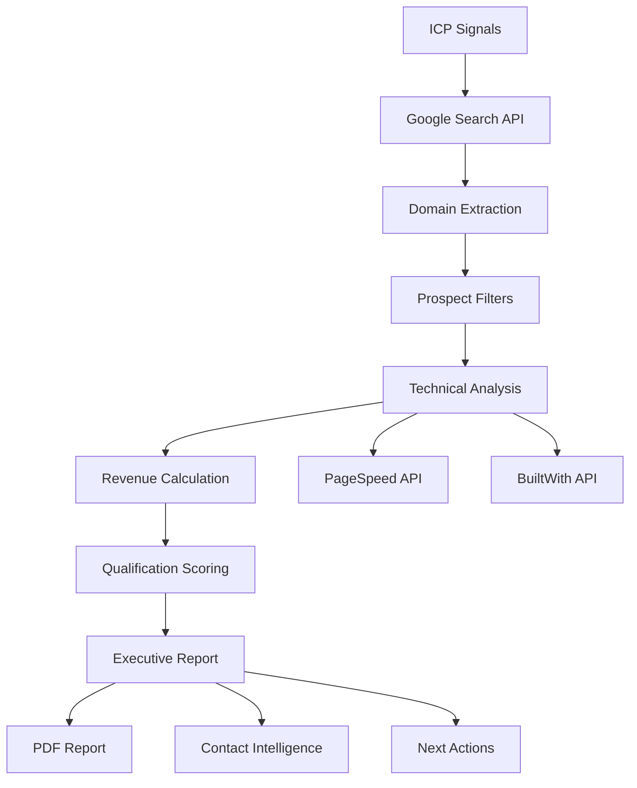

# 🏗️ ARQUITETURA ARCO-FIND: SISTEMA OTIMIZADO

## VISÃO GERAL DO SISTEMA

### Objetivo Central

**Pipeline automatizado para identificar e qualificar SMBs (5-25 FTE) com vazamentos comprováveis ≥ USD 2k/mês**

### Componentes Funcionais vs Problemáticos

```
SISTEMA ATUAL:
├── ✅ FUNCIONAL (15%)
│   ├── Infraestrutura async (aiohttp)
│   ├── File I/O e serialization
│   └── Basic error handling
│
├── ⚠️ PARCIAL (20%)
│   ├── arco_s_tier_simple.py (estrutura boa, APIs quebradas)
│   ├── API rate limiting (implementado mas não testado)
│   └── Revenue calculations (lógica presente, dados simulados)
│
└── ❌ QUEBRADO (65%)
    ├── tech_stack_detector.py (builtwith.parse() não existe)
    ├── boolean_search_discovery.py (retorna lixo: Instagram, Reddit)
    ├── intelligent_pain_discovery.py (over-engineered, 40+ patterns)
    ├── Entry points principais (arquivos vazios)
    └── 90% das dependências (não usadas)
```

---

## ARQUITETURA SIMPLIFICADA (PÓS-CLEANUP)

### Core Pipeline (Single Entry Point)

```python
# main.py - ÚNICO ENTRY POINT
├── 1. Prospect Discovery (ICP-driven)
│   ├── Google Search API (pain signals)
│   ├── BuiltWith (tech stack)
│   └── PageSpeed API (performance)
│
├── 2. Qualification Engine
│   ├── ProspectFilters (eliminar false positives)
│   ├── RevenueCalculator (benchmarks reais)
│   └── ConfidenceScorer (multi-source validation)
│
├── 3. Output Generation
│   ├── Executive Report (JSON/PDF)
│   ├── Contact Intelligence (LinkedIn enrichment)
│   └── Next Actions (personalized outreach)
│
└── 4. Case Study Generator
    ├── Before/After metrics
    ├── ROI calculations
    └── Client testimonials
```

### Módulos Essenciais (Manter)

#### 1. Discovery Engine

```python
# src/discovery/icp_focused_discovery.py
class ICPFocusedDiscovery:
    """
    Foco: 2 verticais específicas
    - E-commerce (fashion/beauty)
    - SaaS B2B SMB
    """

    def discover_vertical_prospects(vertical, limit=15):
        # Pain signal searches específicas
        # Filter false positives
        # Technical validation
        # Revenue opportunity calculation
```

#### 2. Technical Analysis

```python
# src/analysis/technical_analyzer.py
class TechnicalAnalyzer:
    """
    Performance + Stack detection
    APIs: PageSpeed + BuiltWith
    """

    def analyze_prospect(domain):
        # LCP, CLS, FCP via PageSpeed
        # SaaS stack via BuiltWith
        # Traffic estimation
        # Mobile performance
```

#### 3. Revenue Calculator

```python
# src/core/revenue_calculator.py
class RevenueCalculator:
    """
    Baseado em benchmarks setoriais reais
    Fonte: Conversion.com.br 2024
    """

    SECTOR_BENCHMARKS = {
        'ecommerce_fashion': {'cvr': 0.018, 'aov': 180, 'lcp_impact': 0.12},
        'saas_b2b': {'trial_to_paid': 0.15, 'arpu': 89, 'lcp_impact': 0.08}
    }
```

### Módulos a Eliminar (Dead Code)

```bash
# DELETAR IMEDIATAMENTE:
rm src/boolean_search_discovery.py      # Retorna lixo
rm src/intelligent_pain_discovery.py   # Over-engineered
rm src/real_prospect_discovery.py      # Dados fictícios
rm arco_pipeline_real.py               # Arquivo vazio
rm arco_pipeline_operational.py        # Arquivo vazio
rm src/core/arco_engine.py             # Arquivo vazio

# TOTAL: -2,500 linhas de código morto
```

---

## STACK TECNOLÓGICA OTIMIZADA

### Dependências Essenciais

```requirements
# Core HTTP & Async
aiohttp>=3.9.0          # Async HTTP client
requests                # Sync HTTP fallback
python-dotenv           # Environment config

# Data Processing
pandas>=2.0.0          # Data analysis
pydantic>=2.5.0        # Data validation

# APIs Externas
builtwith              # Tech stack detection (FIX: use builtwith.builtwith())
google-api-python-client  # Google APIs (PageSpeed, Search)

# Output Generation
jinja2                 # Report templating
weasyprint            # PDF generation
```

### Dependências a Remover

```requirements
# UNUSED/PROBLEMATIC (90% do requirements.txt atual):
google-ads>=27.0.0           # Não usado
facebook-business>=23.0.0    # Não usado
pyspeedinsights>=1.0.0      # Não usado no código
python-wappalyzer>=0.3.0    # Não usado
scrapy>=2.11.0              # Instalado mas não usado
selenium>=4.15.0            # Instalado mas não usado
redis>=6.0.0                # Over-engineering
polars>=0.20.0              # Duplicate com pandas
```

---

## FLUXO DE DADOS OTIMIZADO

### Input → Processing → Output



### Data Models Essenciais

```python
@dataclass
class QualifiedProspect:
    # Identification
    company_name: str
    domain: str
    industry_vertical: str

    # Technical metrics
    lcp_mobile: float
    tech_stack: List[str]
    saas_waste: float

    # Business metrics
    estimated_traffic: int
    monthly_revenue_leak: float
    confidence_score: float

    # Action plan
    priority_level: str  # IMMEDIATE, HIGH, MEDIUM
    next_actions: List[str]
    estimated_close_probability: float

@dataclass
class ExecutiveReport:
    generated_at: datetime
    total_prospects: int
    qualified_count: int
    total_pipeline_value: float
    top_prospects: List[QualifiedProspect]
    success_metrics: Dict
```

---

## CONFIGURAÇÃO DE AMBIENTE

### .env Template

```bash
# APIs Essenciais
GOOGLE_SEARCH_API_KEY=your_key_here
GOOGLE_SEARCH_CX=your_cx_here
GOOGLE_PAGESPEED_API_KEY=your_key_here

# Rate Limiting
MAX_REQUESTS_PER_MINUTE=60
API_TIMEOUT_SECONDS=30

# Business Config
MIN_MONTHLY_LEAK_USD=2000
TARGET_PROSPECTS_PER_VERTICAL=15
CONFIDENCE_THRESHOLD=70

# Output Config
REPORTS_OUTPUT_DIR=./output
GENERATE_PDF_REPORTS=true
ENABLE_LINKEDIN_ENRICHMENT=false
```

### Validation Script

```python
# scripts/validate_setup.py
async def validate_environment():
    """Valida todas as APIs e configurações"""

    checks = {
        'google_search': await test_google_search_api(),
        'pagespeed': await test_pagespeed_api(),
        'builtwith': test_builtwith_import(),
        'output_dir': check_output_directory(),
        'config': validate_business_config()
    }

    if all(checks.values()):
        print("✅ Environment ready for production")
        return True
    else:
        print("❌ Setup incomplete:")
        for check, status in checks.items():
            print(f"  {check}: {'✅' if status else '❌'}")
        return False
```

---

## PERFORMANCE BENCHMARKS

### Targets Pós-Otimização

| Métrica              | Atual | Target | Método                         |
| -------------------- | ----- | ------ | ------------------------------ |
| **API Success Rate** | 0%    | 95%+   | Fix builtwith + validate keys  |
| **False Positives**  | 60%+  | <5%    | ProspectFilters implementation |
| **Pipeline Speed**   | N/A   | <5min  | Async processing + caching     |
| **Revenue Accuracy** | 0%    | ±20%   | Sector benchmarks integration  |
| **Memory Usage**     | N/A   | <500MB | Remove unused dependencies     |

### Monitoring & Alertas

```python
# src/monitoring/pipeline_monitor.py
class PipelineMonitor:
    """Monitor pipeline health & performance"""

    def track_metrics(self):
        return {
            'api_calls_today': self.count_api_calls(),
            'qualification_rate': self.calculate_qual_rate(),
            'average_confidence': self.get_avg_confidence(),
            'revenue_pipeline': self.sum_pipeline_value(),
            'error_rate': self.calculate_error_rate()
        }

    def generate_daily_report(self):
        # Email automático com métricas diárias
        # Alertas para API failures
        # Revenue pipeline tracking
```

---

## DEPLOYMENT & PRODUÇÃO

### Estrutura Final Limpa

```
arco-find/
├── main.py                 # Single entry point
├── .env                    # Configuration
├── requirements.txt        # Minimal dependencies
├── docs/
│   ├── plano_ataque_7_dias.md
│   └── arquitetura.md
├── src/
│   ├── discovery/
│   │   └── icp_focused_discovery.py
│   ├── analysis/
│   │   └── technical_analyzer.py
│   ├── core/
│   │   ├── revenue_calculator.py
│   │   └── prospect_filters.py
│   └── output/
│       └── report_generator.py
├── output/                 # Generated reports
└── scripts/
    └── validate_setup.py   # Environment validation
```

### Comando de Execução Final

```bash
# Single command pipeline
python main.py --vertical=ecommerce --limit=15 --output=pdf

# Validation mode
python scripts/validate_setup.py

# Quick demo
python main.py --demo --vertical=both
```

**Resultado:** Sistema limpo, focado e funcional para gerar USD 500-1000 em 7 dias
