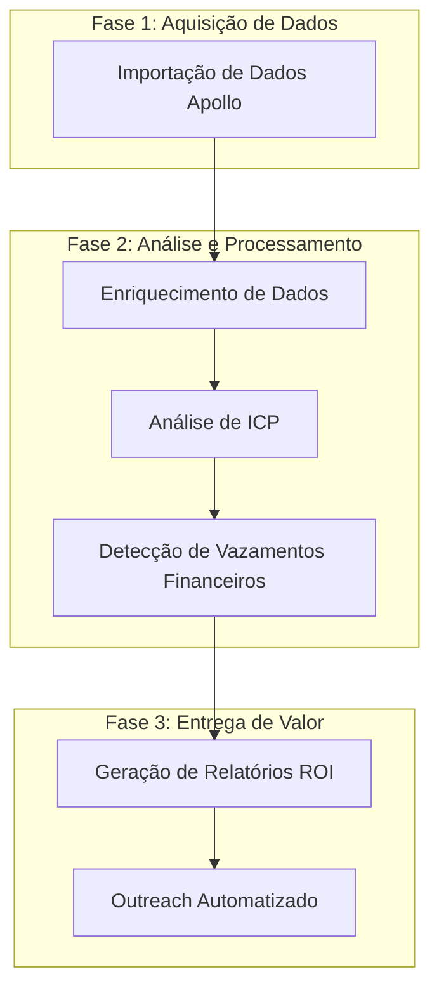

# Plano de Execução do Pipeline ARCO

## Visão Geral

Este documento apresenta o plano de execução consolidado para o pipeline ARCO, focando na utilização de dados reais de empresas obtidos através da integração com o Apollo CSV. O objetivo é gerar insights de valor real e acionáveis para empresas, identificando oportunidades de otimização de SaaS e vazamentos financeiros.

## Fluxo de Execução



## Fase 1: Aquisição de Dados

### 1.1 Importação de Dados Apollo

**Objetivo:** Importar dados reais de empresas dos arquivos CSV do Apollo.

**Ações:**

- Carregar todos os arquivos CSV do Apollo disponíveis
- Converter registros para o modelo de Prospect do ARCO
- Validar e limpar dados para garantir qualidade

**Métricas:**

- Número total de prospectos importados
- Taxa de dados completos (% de registros com todos os campos essenciais)
- Distribuição por indústria, tamanho e país

**Código de Execução:**

```python
from arco.integrations.apollo_csv import ApolloCSVIntegration

# Inicializar integração Apollo
apollo_integration = ApolloCSVIntegration()

# Importar todos os prospectos
prospects = apollo_integration.get_all_prospects()
print(f"Importados {len(prospects)} prospectos do Apollo")

# Análise básica de distribuição
industries = {}
sizes = {"1-10": 0, "11-50": 0, "51-200": 0, "201+": 0}
countries = {}

for prospect in prospects:
    # Contagem por indústria
    if prospect.industry:
        industries[prospect.industry] = industries.get(prospect.industry, 0) + 1

    # Contagem por tamanho
    if prospect.employee_count:
        if prospect.employee_count <= 10:
            sizes["1-10"] += 1
        elif prospect.employee_count <= 50:
            sizes["11-50"] += 1
        elif prospect.employee_count <= 200:
            sizes["51-200"] += 1
        else:
            sizes["201+"] += 1

    # Contagem por país
    if prospect.country:
        countries[prospect.country] = countries.get(prospect.country, 0) + 1

# Exibir resultados
print("\nDistribuição por indústria:")
for industry, count in sorted(industries.items(), key=lambda x: x[1], reverse=True)[:10]:
    print(f"- {industry}: {count}")

print("\nDistribuição por tamanho:")
for size, count in sizes.items():
    print(f"- {size}: {count}")

print("\nDistribuição por país:")
for country, count in sorted(countries.items(), key=lambda x: x[1], reverse=True)[:10]:
    print(f"- {country}: {count}")
```

## Fase 2: Análise e Processamento

### 2.1 Enriquecimento de Dados

**Objetivo:** Complementar os dados do Apollo com informações adicionais para análise mais precisa.

**Ações:**

- Enriquecer dados de tecnologia usando Wappalyzer
- Validar e normalizar dados de receita e número de funcionários
- Categorizar empresas por vertical de mercado

**Métricas:**

- Taxa de enriquecimento (% de prospectos com dados adicionados)
- Número médio de tecnologias identificadas por prospecto
- Precisão da categorização de mercado

**Código de Execução:**

```python
from arco.integrations.wappalyzer import WappalyzerIntegration
import asyncio

# Inicializar integração Wappalyzer
wappalyzer = WappalyzerIntegration()

async def enrich_prospect(prospect):
    """
    Função para enriquecer um prospecto.
    """
    try:
        # Enriquecer com tecnologias do Wappalyzer
        if prospect.website:
            try:
                tech_data = await wappalyzer.analyze_url(prospect.website)

                # Adicionar tecnologias que ainda não existem no prospecto
                existing_tech_names = {tech.name.lower() for tech in prospect.technologies}

                for tech_name, tech_info in tech_data.items():
                    if tech_name.lower() not in existing_tech_names:
                        category = tech_info.get('category', 'other')
                        version = tech_info.get('version')
                        prospect.technologies.append(Technology(name=tech_name, category=category, version=version))

                return True
            except Exception as e:
                print(f"Erro ao enriquecer {prospect.domain}: {e}")
                return False
    except Exception as e:
        print(f"Erro ao enriquecer {prospect.domain}: {e}")
        return False

async def enrich_all_prospects(prospects, batch_size=10):
    """
    Enriquecer todos os prospectos.
    """
    # Total de tecnologias antes
    total_techs_before = sum(len(p.technologies) for p in prospects)

    enriched_count = 0

    # Processar em lotes para evitar sobrecarga
    for i in range(0, len(prospects), batch_size):
        batch = prospects[i:i+batch_size]
        tasks = [enrich_prospect(p) for p in batch]
        results = await asyncio.gather(*tasks)
        enriched_count += sum(results)
        print(f"Processando lote {i//batch_size + 1}/{(len(prospects)-1)//batch_size + 1}")

    # Total de tecnologias depois
    total_techs_after = sum(len(p.technologies) for p in prospects)

    print("\nEnriquecimento concluído:")
    print(f"- Prospectos enriquecidos: {enriched_count}/{len(prospects)} ({enriched_count/len(prospects):.1%})")
    print(f"- Tecnologias antes: {total_techs_before}")
    print(f"- Tecnologias depois: {total_techs_after}")
    print(f"- Tecnologias adicionadas: {total_techs_after - total_techs_before}")
    print(f"- Média de tecnologias por prospecto: {total_techs_after/len(prospects):.1f}")

    return prospects

# Executar enriquecimento
enriched_prospects = asyncio.run(enrich_all_prospects(prospects))
```

### 2.2 Análise de ICP (Ideal Customer Profile)

**Objetivo:** Identificar prospectos que melhor se alinham aos ICPs definidos.

**Ações:**

- Aplicar modelos de ICP aos Prospectos enriquecidos
- Calcular scores de match para cada ICP
- Priorizar prospectos com maiores scores de conversão

**Métricas:**

- Distribuição de scores de match por ICP
- Número de prospectos qualificados
- Taxa de qualificação por ICP (% de prospectos acima do threshold)

**Código de Execução:**

```python
from arco.models.icp import ShopifyDTCPremiumICP, HealthSupplementsICP, FitnessEquipmentICP
from arco.engines.discovery_engine import DiscoveryEngine

# Criar ICPs
icps = {
    "shopify_dtc": ShopifyDTCPremiumICP(),
    "health_supplements": HealthSupplementsICP(),
    "fitness_equipment": FitnessEquipmentICP()
}

# Analisar prospectos para cada ICP
icp_results = {}

for icp_name, icp in icps.items():
    # Criar engine com o ICP
    engine = DiscoveryEngine(icp=icp)

    # Filtrar prospectos qualificados
    qualified_prospects = engine._filter_prospects_by_icp(enriched_prospects)

    # Calcular scores para todos os prospectos
    all_scores = []
    for prospect in enriched_prospects:
        score = icp.calculate_match_score(prospect)
        all_scores.append(score)

    # Calcular métricas
    icp_results[icp_name] = {
        "icp_name": icp.name,
        "total_prospects": len(enriched_prospects),
        "qualified_prospects": len(qualified_prospects),
        "qualification_rate": len(qualified_prospects) / len(enriched_prospects),
        "avg_match_score": sum(all_scores) / len(all_scores),
        "score_distribution": {
            "0-25": sum(1 for s in all_scores if s < 25),
            "25-50": sum(1 for s in all_scores if 25 <= s < 50),
            "50-75": sum(1 for s in all_scores if 50 <= s < 75),
            "75-100": sum(1 for s in all_scores if s >= 75)
        }
    }

# Exibir resultados
for icp_name, results in icp_results.items():
    print(f"\nResultados para ICP: {results['icp_name']}")
    print(f"- Total de prospectos: {results['total_prospects']}")
    print(f"- Prospectos qualificados: {results['qualified_prospects']} ({results['qualification_rate']:.1%})")
    print(f"- Score médio: {results['avg_match_score']:.1f}/100")

    print(f"- Distribuição de scores:")
    for range_name, count in results['score_distribution'].items():
        print(f"  * {range_name}: {count} ({count/results['total_prospects']:.1%})")
```

### 2.3 Detecção de Vazamentos Financeiros

**Objetivo:** Identificar oportunidades reais de economia e otimização para cada prospecto.

**Ações:**

- Analisar stack de tecnologia para identificar redundâncias
- Estimar desperdícios financeiros com base nos dados reais
- Priorizar oportunidades de maior impacto

**Métricas:**

- Valor total de vazamentos financeiros identificados
- Média de economia mensal por prospecto
- Distribuição de tipos de vazamento

**Código de Execução:**

```python
from arco.models.financial_leak import FinancialLeakDetector

# Criar detector de vazamentos financeiros
leak_detector = FinancialLeakDetector()

# Analisar vazamentos para cada ICP
leak_results_by_icp = {}

for icp_name, results in icp_results.items():
    # Inicializar resultados para este ICP
    leak_results_by_icp[icp_name] = {
        "icp_name": results["icp_name"],
        "total_prospects": len(enriched_prospects),
        "qualified_prospects": len(qualified_prospects),
        "total_monthly_waste": 0.0,
        "total_annual_waste": 0.0,
        "total_monthly_savings": 0.0,
        "total_annual_savings": 0.0,
        "avg_roi_percentage": 0.0,
        "redundancy_types": {},
        "prospect_results": []
    }

    # Analisar cada prospecto
    roi_percentages = []

    for prospect in qualified_prospects:
        # Detectar vazamentos financeiros
        leak_result = leak_detector.detect_financial_leaks(prospect)

        # Adicionar resultado individual
        leak_results_by_icp[icp_name]["prospect_results"].append({
            "domain": prospect.domain,
            "company_name": prospect.company_name,
            "monthly_waste": summary["total_monthly_waste"],
            "annual_waste": summary["total_annual_waste"],
            "monthly_savings": summary["total_monthly_savings"],
            "annual_savings": summary["total_annual_savings"],
            "roi_percentage": summary["roi_percentage"]
        })

        # Adicionar ao total
        leak_results_by_icp[icp_name]["total_monthly_waste"] += summary["total_monthly_waste"]
        leak_results_by_icp[icp_name]["total_annual_waste"] += summary["total_annual_waste"]
        leak_results_by_icp[icp_name]["total_monthly_savings"] += summary["total_monthly_savings"]
        leak_results_by_icp[icp_name]["total_annual_savings"] += summary["total_annual_savings"]

        # Adicionar ROI percentagem à lista para cálculo de média
        if summary["roi_percentage"] > 0:
            roi_percentages.append(summary["roi_percentage"])

        # Contar tipos de redundância
        if "redundant_apps" in leak_result and leak_result["redundant_apps"]["redundancies_detected"]:
            for pattern in leak_result["redundant_apps"]["patterns_matched"]:
                pattern_name = pattern["name"]
                leak_results_by_icp[icp_name]["redundancy_types"] = leak_results_by_icp[icp_name].get("redundancy_types", {})
                leak_results_by_icp[icp_name]["redundancy_types"][pattern_name] = leak_results_by_icp[icp_name]["redundancy_types"].get(pattern_name, 0) + 1

    # Calcular média de ROI
    if roi_percentages:
        leak_results_by_icp[icp_name]["avg_roi_percentage"] = sum(roi_percentages) / len(roi_percentages)

    # Ordenar prospectos por economia anual
    leak_results_by_icp[icp_name]["prospect_results"].sort(key=lambda x: x["annual_savings"], reverse=True)

# Exibir resultados
for icp_name, results in leak_results_by_icp.items():
    print(f"\nResultados de vazamentos financeiros para ICP: {results['icp_name']}")
    print(f"- Total de prospectos analisados: {results['total_prospects']}")
    print(f"- Desperdício mensal total: ${results['total_monthly_waste']:.2f}")
    print(f"- Desperdício anual total: ${results['total_annual_waste']:.2f}")
    print(f"- Economia mensal total: ${results['total_monthly_savings']:.2f}")
    print(f"- Economia anual total: ${results['total_annual_savings']:.2f}")
    print(f"- ROI percentual médio: {results['avg_roi_percentage']:.1f}%")

    print("\nTipos de redundâncias mais comuns:")
    for redundancy_type, count in sorted(results["redundancy_types"].items(), key=lambda x: x[1], reverse=True):
        print(f"- {redundancy_type}: {count} ocorrências")

    print("\nTop 5 prospectos com maior potencial de economia:")
    for i, prospect_result in enumerate(results["prospect_results"][:5]):
        print(f"{i+1}. {prospect_result['company_name']} ({prospect_result['domain']})")
        print(f"   - Economia anual: ${prospect_result['annual_savings']:.2f}")
        print(f"   - ROI: {prospect_result['roi_percentage']:.1f}%")
```

## Fase 3: Entrega de Valor

### 3.1 Geração de Relatórios ROI

**Objetivo:** Criar relatórios personalizados de ROI para cada prospecto qualificado.

**Ações:**

- Gerar relatórios detalhados de ROI com base nos dados reais
- Personalizar recomendações para cada prospecto
- Preparar materiais para apresentação ao cliente

**Métricas:**

- Número de relatórios gerados
- Economia média projetada por relatório
- Distribuição de tipos de recomendação

**Código de Execução:**

```python
from arco.models.roi_report import ROIReportGenerator

# Criar gerador de relatórios ROI
report_generator = ROIReportGenerator()

# Criar diretório para relatórios
reports_dir = "reports"
os.makedirs(reports_dir, exist_ok=True)

# Gerar relatórios para cada ICP
report_stats = {}

for icp_name, results in leak_results_by_icp.items():
    # Inicializar estatísticas para este ICP
    report_stats[icp_name] = {
        "icp_name": results["icp_name"],
        "reports_generated": 0,
        "total_annual_savings": 0.0,
        "avg_annual_savings": 0.0,
        "recommendation_types": {}
    }

    # Criar subdiretório para este ICP
    icp_dir = os.path.join(reports_dir, icp_name)
    os.makedirs(icp_dir, exist_ok=True)

    # Gerar relatórios para os top prospectos
    top_prospects = [p["domain"] for p in results["prospect_results"][:20]]

    for prospect_result in results["prospect_results"][:20]:
        # Encontrar objeto Prospect correspondente
        prospect = next((p for p in enriched_prospects if p.domain == prospect_result["domain"]), None)

        if prospect:
            # Gerar relatório
            report = report_generator.generate_roi_report(prospect)

            # Salvar relatório
            filepath = report_generator.save_report_to_file(report, icp_dir)

            # Gerar versão HTML
            html_content = report_generator.generate_html_report(report)
            html_filepath = filepath.replace(".md", ".html")
            with open(html_filepath, "w", encoding="utf-8") as f:
                f.write(html_content)

            # Atualizar estatísticas
            report_stats[icp_name]["reports_generated"] += 1
            report_stats[icp_name]["total_annual_savings"] += prospect_result["annual_savings"]

            # Contar tipos de recomendação
            for rec in report["financial_leaks"]["priority_recommendations"]:
                rec_type = rec.split(":")[0] if ":" in rec else rec
                report_stats[icp_name]["recommendation_types"][rec_type] = report_stats[icp_name].get("recommendation_types", {}).get(rec_type, 0) + 1

    # Calcular média
    if report_stats[icp_name]["reports_generated"] > 0:
        report_stats[icp_name]["avg_annual_savings"] = report_stats[icp_name]["total_annual_savings"] / report_stats[icp_name]["reports_generated"]

# Exibir estatísticas
for icp_name, stats in report_stats.items():
    print(f"\nEstatísticas de relatórios para ICP: {stats['icp_name']}")
    print(f"- Relatórios gerados: {stats['reports_generated']}")
    print(f"- Economia anual total: ${stats['total_annual_savings']:.2f}")
    print(f"- Economia anual média: ${stats['avg_annual_savings']:.2f}")

    print("\nTipos de recomendação mais comuns:")
    for rec_type, count in sorted(stats["recommendation_types"].items(), key=lambda x: x[1], reverse=True)[:5]:
        print(f"- {rec_type}: {count} ocorrências")
```

### 3.2 Outreach Automatizado

**Objetivo:** Implementar sistema de outreach automatizado para prospectos qualificados.

**Ações:**

- Criar templates de email personalizados por ICP
- Priorizar prospectos com maior potencial de ROI
- Automatizar sequência de follow-up
- Integrar com ferramentas de outreach
- Gerar dashboards para prospectos

**Métricas:**

- Número de emails enviados
- Taxa de abertura e resposta
- Conversão para reuniões agendadas
- Taxa de engajamento
- ROI da campanha de outreach

**Código de Execução:**

```python
# Implementação do sistema de outreach automatizado

import sys
import os
import json
import asyncio
from datetime import datetime, timedelta
from typing import Dict, List, Any, Optional

# Importar componentes necessários
from arco.integrations.outreach_integration import outreach_manager
from arco.utils.progress_tracker import tracker, ProgressStage
from arco.models.prospect import Prospect

async def send_initial_outreach(prospect: Prospect, analysis_results: Dict[str, Any]) -> str:
    """
    Envia outreach inicial para um prospecto qualificado.

    Args:
        prospect: Prospecto qualificado
        analysis_results: Resultados da análise

    Returns:
        ID da mensagem se bem-sucedido, string vazia caso contrário
    """
    try:
        # Obter ID do lead do tracker
        lead_id = tracker.get_lead_by_domain(prospect.domain).lead_id

        # Selecionar template com base nos resultados da análise
        template_name = outreach_manager.select_template_for_prospect(prospect, analysis_results)

        # Preparar dados de personalização
        leak_results = analysis_results.get("leak_results", {})
        summary = leak_results.get("summary", {})

        # Extrair categorias de redundância e áreas de otimização
        redundancy_categories = []
        optimization_areas = []

        if "redundant_apps" in leak_results and leak_results["redundant_apps"]["redundancies_detected"]:
            for pattern in leak_results["redundant_apps"]["patterns_matched"]:
                redundancy_categories.append(pattern["name"])

        if "performance_conversion" in leak_results and leak_results["performance_conversion"]["issues_detected"]:
            for analysis in leak_results["performance_conversion"]["analyses"]:
                optimization_areas.append(analysis["name"])

        personalization = {
            "monthly_waste": f"${summary.get('total_monthly_waste', 0):.2f}",
            "annual_waste": f"${summary.get('total_annual_waste', 0):.2f}",
            "monthly_savings": f"${summary.get('total_monthly_savings', 0):.2f}",
            "annual_savings": f"${summary.get('total_annual_savings', 0):.2f}",
            "roi_percentage": f"{summary.get('roi_percentage', 0):.1f}%",
            "redundancy_categories": ", ".join(redundancy_categories[:3]) or "ferramentas redundantes",
            "optimization_areas": ", ".join(optimization_areas[:3]) or "áreas de performance",
            "top_recommendation": summary.get("priority_recommendations", [""])[0] if summary.get("priority_recommendations") else ""
        }

        # Enviar mensagem
        message_id = outreach_manager.send_message(prospect, template_name, personalization)

        if message_id:
            print(f"Enviado outreach inicial para {prospect.company_name} ({prospect.domain}) usando template: {template_name}")

            # Atualizar tracker
            tracker.update_stage(lead_id, ProgressStage.CONTACTED, {
                "message_id": message_id,
                "template_name": template_name,
                "timestamp": datetime.now().isoformat(),
                "success": True
            })
        else:
            print(f"Falha ao enviar outreach para {prospect.company_name} ({prospect.domain})")

            # Atualizar tracker com erro
            tracker.add_error(lead_id, ProgressStage.CONTACTED, "Falha ao enviar mensagem de outreach")

        return message_id
    except Exception as e:
        print(f"Erro ao enviar outreach: {e}")
        return ""

async def process_qualified_prospects(qualified_only: bool = True, days_since_contact: int = 3) -> Dict[str, Any]:
    """
    Processa prospectos qualificados para outreach.

    Args:
        qualified_only: Apenas processar prospectos qualificados
        days_since_contact: Dias desde o contato inicial para follow-ups

    Returns:
        Resultados do processamento
    """
    results = {
        "initial_outreach": [],
        "follow_ups": [],
        "total_processed": 0,
        "successful_outreach": 0,
        "successful_follow_ups": 0
    }

    # Obter prospectos qualificados
    qualified_leads = tracker.get_leads_by_stage(ProgressStage.QUALIFIED)
    print(f"Encontrados {len(qualified_leads)} leads qualificados")

    # Obter prospectos contatados para follow-ups
    contacted_leads = tracker.get_leads_by_stage(ProgressStage.CONTACTED)
    print(f"Encontrados {len(contacted_leads)} leads contatados para possível follow-up")

    # Processar prospectos qualificados para outreach inicial
    for lead in qualified_leads:
        # Obter dados do prospecto e análise
        prospect = next((p for p in enriched_prospects if p.domain == lead.domain), None)
        if prospect:
            # Obter resultados da análise do tracker
            analysis_results = lead.metadata.get(ProgressStage.ANALYZED, {})

            # Enviar outreach inicial
            message_id = await send_initial_outreach(prospect, analysis_results)

            if message_id:
                results["successful_outreach"] += 1
                results["initial_outreach"].append({
                    "domain": lead.domain,
                    "company_name": lead.company_name,
                    "message_id": message_id
                })

            results["total_processed"] += 1

    # Processar prospectos contatados para follow-ups
    for lead in contacted_leads:
        prospect = next((p for p in enriched_prospects if p.domain == lead.domain), None)
        if prospect:
            # Verificar se passou tempo suficiente para follow-up
            contact_metadata = lead.metadata.get(ProgressStage.CONTACTED, {})
            contact_timestamp = contact_metadata.get("timestamp")

            if contact_timestamp:
                contact_date = datetime.fromisoformat(contact_timestamp)
                days_elapsed = (datetime.now() - contact_date).days

                if days_elapsed >= days_since_contact:
                    # Enviar follow-up
                    message_id = outreach_manager.send_follow_up(prospect, days_since_contact)

                    if message_id:
                        results["successful_follow_ups"] += 1
                        results["follow_ups"].append({
                            "domain": lead.domain,
                            "company_name": lead.company_name,
                            "message_id": message_id,
                            "days_since_contact": days_elapsed
                        })

                    results["total_processed"] += 1

    return results

def generate_outreach_report(results: Dict[str, Any]) -> Dict[str, Any]:
    """
    Gera um relatório de outreach.

    Args:
        results: Resultados do processamento

    Returns:
        Relatório de outreach
    """
    # Obter resumo do tracker
    tracker_summary = tracker.get_summary()

    # Calcular métricas
    total_qualified = tracker_summary["stage_counts"].get(ProgressStage.QUALIFIED, 0)
    total_contacted = tracker_summary["stage_counts"].get(ProgressStage.CONTACTED, 0)
    total_engaged = tracker_summary["stage_counts"].get(ProgressStage.ENGAGED, 0)

    contact_rate = total_contacted / total_qualified if total_qualified > 0 else 0
    engagement_rate = total_engaged / total_contacted if total_contacted > 0 else 0

    # Compilar relatório
    return {
        "timestamp": datetime.now().isoformat(),
        "total_qualified_prospects": total_qualified,
        "total_contacted_prospects": total_contacted,
        "total_engaged_prospects": total_engaged,
        "contact_rate": contact_rate,
        "engagement_rate": engagement_rate,
        "new_outreach": len(results["initial_outreach"]),
        "new_follow_ups": len(results["follow_ups"]),
        "total_processed": results["total_processed"],
        "successful_outreach": results["successful_outreach"],
        "successful_follow_ups": results["successful_follow_ups"],
        "success_rate": (results["successful_outreach"] + results["successful_follow_ups"]) / results["total_processed"] if results["total_processed"] > 0 else 0
    }

# Exemplo de uso
async def main():
    # Inicializar integração de outreach
    outreach_manager.initialize_integration(
        "email",
        smtp_server="smtp.example.com",
        smtp_port=587,
        username="user@example.com",
        password="password",
        from_email="outreach@example.com",
        from_name="ARCO Team"
    )

    # Processar prospectos qualificados
    results = await process_qualified_prospects(qualified_only=True, days_since_contact=3)

    # Gerar relatório
    report = generate_outreach_report(results)

    # Exibir resultados
    print("\nResumo de Outreach:")
    print(f"- Total de prospectos qualificados: {report['total_qualified_prospects']}")
    print(f"- Total de prospectos contatados: {report['total_contacted_prospects']} ({report['contact_rate']:.1%})")
    print(f"- Total de prospectos engajados: {report['total_engaged_prospects']} ({report['engagement_rate']:.1%})")
    print(f"- Novos outreaches: {report['new_outreach']}")
    print(f"- Novos follow-ups: {report['new_follow_ups']}")
    print(f"- Taxa de sucesso: {report['success_rate']:.1%}")

if __name__ == "__main__":
    asyncio.run(main())
```

## Conclusão

Este plano de execução fornece um framework completo para utilizar dados reais do Apollo CSV no pipeline ARCO, gerando insights de valor para empresas. Ao focar em dados reais, podemos identificar oportunidades concretas de otimização SaaS e vazamentos financeiros, entregando valor mensurável para os clientes.
