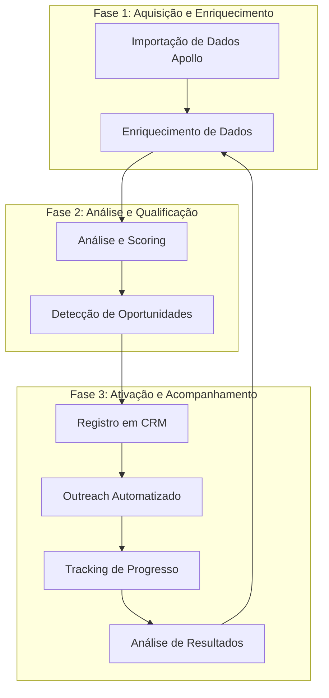

# Abordagem Estratégica para Enriquecimento e Análise de Leads

## Visão Geral

Este documento descreve a abordagem estratégica para o enriquecimento, análise e tracking de leads obtidos através dos dados do Apollo. O objetivo é transformar dados brutos em oportunidades de negócio qualificadas, com um processo estruturado de acompanhamento e registro em CRM.

## Fluxo de Trabalho



## Fase 1: Aquisição e Enriquecimento

### 1.1 Importação de Dados Apollo

**Objetivo:** Importar e normalizar dados de empresas dos arquivos CSV do Apollo.

**Estratégia:**

- Priorizar arquivos CSV mais recentes
- Consolidar dados duplicados, mantendo as informações mais completas
- Validar e limpar dados para garantir qualidade
- Estabelecer um processo de atualização periódica (semanal/mensal)

**Métricas de Sucesso:**

- Volume de leads importados
- Taxa de completude dos dados (% de campos preenchidos)
- Taxa de duplicação resolvida

### 1.2 Enriquecimento de Dados

**Objetivo:** Complementar os dados do Apollo com informações adicionais para análise mais precisa.

**Estratégia:**

- Enriquecimento em camadas, priorizando leads com maior potencial
- Utilização de múltiplas fontes para validação cruzada
- Implementação de cache para otimizar requisições a APIs externas
- Tracking de progresso de enriquecimento para cada lead

**Fontes de Enriquecimento:**

1. **Wappalyzer** - Stack tecnológico
2. **LinkedIn** - Informações da empresa e funcionários
3. **Clearbit** - Dados financeiros e de mercado
4. **BuiltWith** - Tecnologias utilizadas
5. **Google PageSpeed** - Performance do site

**Métricas de Sucesso:**

- Taxa de enriquecimento (% de leads com dados adicionados)
- Número médio de tecnologias identificadas por lead
- Tempo médio de enriquecimento por lead

## Fase 2: Análise e Qualificação

### 2.1 Análise e Scoring

**Objetivo:** Avaliar cada lead com base em múltiplos critérios para determinar seu potencial.

**Estratégia:**

- Implementação de um sistema de scoring multicritério
- Ponderação de fatores com base em dados históricos de conversão
- Ajuste dinâmico dos pesos com base nos resultados
- Segmentação de leads por ICP (Ideal Customer Profile)

**Critérios de Scoring:**

1. **Match com ICP** (0-100 pontos)
2. **Potencial de Economia** (0-100 pontos)
3. **Stack Tecnológico** (0-100 pontos)
4. **Tamanho da Empresa** (0-100 pontos)
5. **Sinais de Intenção** (0-100 pontos)

**Fórmula de Scoring:**

```
Score Final = (Match ICP × 0.3) + (Potencial Economia × 0.3) + (Stack Tecnológico × 0.2) + (Tamanho Empresa × 0.1) + (Sinais Intenção × 0.1)
```

**Métricas de Sucesso:**

- Distribuição de scores
- Correlação entre score e taxa de conversão
- Precisão da segmentação por ICP

### 2.2 Detecção de Oportunidades

**Objetivo:** Identificar oportunidades específicas de otimização e economia para cada lead.

**Estratégia:**

- Análise detalhada do stack tecnológico para identificar redundâncias
- Comparação com benchmarks da indústria
- Estimativa de ROI personalizada
- Priorização de oportunidades por impacto e facilidade de implementação

**Tipos de Oportunidades:**

1. **Consolidação de Ferramentas** - Identificação de ferramentas redundantes
2. **Otimização de Performance** - Melhorias de velocidade e conversão
3. **Redução de Custos** - Alternativas mais econômicas
4. **Eficiência Operacional** - Automação e integração

**Métricas de Sucesso:**

- Valor total de oportunidades identificadas
- Média de economia projetada por lead
- Distribuição de tipos de oportunidade

## Fase 3: Ativação e Acompanhamento

### 3.1 Registro em CRM

**Objetivo:** Registrar leads qualificados no CRM com todas as informações relevantes.

**Estratégia:**

- Integração automatizada com o CRM
- Estruturação de dados para facilitar segmentação e follow-up
- Atualização periódica dos dados no CRM
- Tracking de histórico de interações

**Campos a Registrar no CRM:**

1. **Informações Básicas** - Nome, site, contatos, etc.
2. **Dados de Qualificação** - Score, ICP, potencial de ROI
3. **Stack Tecnológico** - Tecnologias utilizadas
4. **Oportunidades Identificadas** - Detalhes das oportunidades
5. **Histórico de Interações** - Emails, chamadas, reuniões

**Métricas de Sucesso:**

- Taxa de sincronização com CRM
- Completude dos registros no CRM
- Tempo médio entre qualificação e primeiro contato

### 3.2 Outreach Automatizado

**Objetivo:** Implementar campanhas de outreach personalizadas para leads qualificados.

**Estratégia:**

- Segmentação de campanhas por ICP e oportunidades identificadas
- Personalização de mensagens com dados específicos do lead
- Sequência de follow-up automatizada
- A/B testing de templates e abordagens

**Elementos de Personalização:**

1. **Nome da empresa e contato**
2. **Oportunidades específicas identificadas**
3. **Economia projetada**
4. **ROI estimado**
5. **Referências relevantes da indústria**

**Métricas de Sucesso:**

- Taxa de abertura de emails
- Taxa de resposta
- Taxa de agendamento de reuniões
- Conversão para oportunidades qualificadas

### 3.3 Tracking de Progresso

**Objetivo:** Monitorar o progresso de cada lead ao longo do funil de vendas.

**Estratégia:**

- Implementação de um sistema de tracking em tempo real
- Definição clara de estágios do funil
- Alertas para leads estagnados
- Dashboards de visualização de progresso

**Estágios de Tracking:**

1. **Importado** - Lead importado do Apollo
2. **Enriquecido** - Dados complementados
3. **Qualificado** - Análise e scoring concluídos
4. **Registrado** - Adicionado ao CRM
5. **Contatado** - Primeiro contato realizado
6. **Engajado** - Resposta recebida
7. **Reunião** - Reunião agendada
8. **Oportunidade** - Proposta enviada
9. **Cliente** - Negócio fechado

**Métricas de Sucesso:**

- Tempo médio em cada estágio
- Taxa de conversão entre estágios
- Identificação de gargalos no funil

### 3.4 Análise de Resultados

**Objetivo:** Avaliar a eficácia do processo e identificar oportunidades de melhoria.

**Estratégia:**

- Análise regular de métricas de performance
- Correlação entre características dos leads e resultados
- Ajuste contínuo de critérios de qualificação
- Refinamento de ICPs com base em dados reais

**Análises a Realizar:**

1. **Conversão por ICP** - Quais ICPs têm melhor performance
2. **Eficácia de Enriquecimento** - Impacto do enriquecimento na conversão
3. **Performance de Outreach** - Eficácia de diferentes abordagens
4. **ROI do Processo** - Retorno sobre investimento no processo

**Métricas de Sucesso:**

- ROI global do processo
- Melhoria contínua nas taxas de conversão
- Redução do custo de aquisição de cliente (CAC)

## Implementação Técnica

### Ferramentas e Tecnologias

1. **Processamento de Dados**

   - Python para processamento de dados
   - Pandas para análise e manipulação
   - Asyncio para processamento paralelo

2. **Enriquecimento**

   - APIs de Wappalyzer, BuiltWith, Clearbit
   - Web scraping para dados públicos
   - Cache Redis para otimização

3. **CRM e Automação**

   - API do HubSpot/Salesforce para integração com CRM
   - Zapier para automações entre sistemas
   - Integração com ferramentas de email marketing

4. **Tracking e Análise**
   - PostgreSQL para armazenamento de dados
   - Metabase/Tableau para visualização
   - Airflow para orquestração de workflows

### Arquitetura de Solução

```
┌─────────────────┐     ┌─────────────────┐     ┌─────────────────┐
│                 │     │                 │     │                 │
│  Importação e   │     │   Análise e     │     │   Ativação e    │
│  Enriquecimento │────▶│  Qualificação   │────▶│ Acompanhamento  │
│                 │     │                 │     │                 │
└─────────────────┘     └─────────────────┘     └─────────────────┘
        │                       │                       │
        ▼                       ▼                       ▼
┌─────────────────┐     ┌─────────────────┐     ┌─────────────────┐
│                 │     │                 │     │                 │
│  Banco de Dados │     │  Serviço de     │     │  Integração     │
│  de Leads       │     │  Scoring        │     │  com CRM        │
│                 │     │                 │     │                 │
└─────────────────┘     └─────────────────┘     └─────────────────┘
        │                       │                       │
        └───────────────────────┼───────────────────────┘
                                ▼
                        ┌─────────────────┐
                        │                 │
                        │  Dashboard de   │
                        │  Tracking       │
                        │                 │
                        └─────────────────┘
```

## Cronograma de Implementação

| Fase | Componente                | Semana 1 | Semana 2 | Semana 3 | Semana 4 |
| ---- | ------------------------- | -------- | -------- | -------- | -------- |
| 1    | Importação de Dados       | ✓        |          |          |          |
| 1    | Enriquecimento Básico     | ✓        | ✓        |          |          |
| 1    | Enriquecimento Avançado   |          | ✓        | ✓        |          |
| 2    | Sistema de Scoring        |          | ✓        | ✓        |          |
| 2    | Detecção de Oportunidades |          |          | ✓        | ✓        |
| 3    | Integração com CRM        |          |          | ✓        | ✓        |
| 3    | Outreach Automatizado     |          |          |          | ✓        |
| 3    | Sistema de Tracking       | ✓        | ✓        | ✓        | ✓        |
| 3    | Dashboard de Análise      |          |          | ✓        | ✓        |

## Conclusão

Esta abordagem estratégica fornece um framework completo para transformar dados brutos do Apollo em oportunidades de negócio qualificadas, com um processo estruturado de enriquecimento, análise, registro em CRM e acompanhamento. A implementação faseada permite um desenvolvimento iterativo, com foco inicial na qualidade dos dados e análise, seguido pela automação e otimização do processo.

O sistema de tracking de progresso e a análise contínua de resultados garantem que o processo seja constantemente refinado, aumentando a eficácia ao longo do tempo e maximizando o ROI dos esforços de prospecção.
